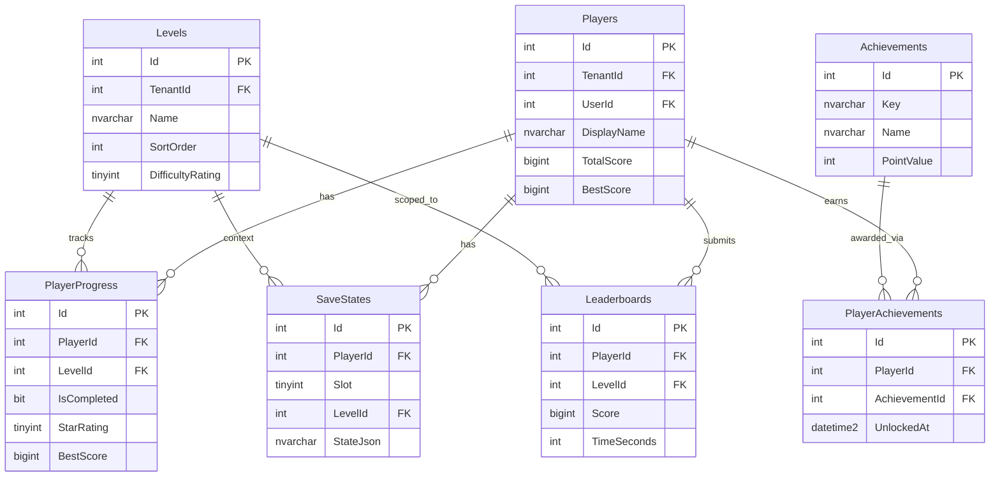

---
name: swp-gamedev
description: |
  Game development planning skill for browser-based projects -- covers interactive mind games, 2D HTML5 games, 3D WebGL games, and game engine architecture.
  Produces GAME-DESIGN.md (mechanics, scenes, HUD), GAME-ARCH.md (engine choice, ECS, asset pipeline, game loop), and GAME-DB.md (player progress, leaderboards, save states).
  Use when the feature or product is a playable game or interactive puzzle in the browser.
  Trigger on: game, puzzle, mind game, 2D game, 3D game, canvas, Phaser, Three.js, WebGL, sprite, tilemap, leaderboard, game engine, game loop, ECS, object pooling.
  Compatible skill chain: /swp-srs -> /swp-gamedev -> /swp-arch -> /swp-design -> /swp-plan -> /swd-start
compatibility: Phaser 3, Three.js, Babylon.js, PixiJS, Kaplay, Vanilla Canvas 2D
---

Command  : /swp-gamedev
Version  : 2.1
Updated  : 2026-05-21

Skill type: WORKFLOW COMMAND

## Standard command safeguards

### Helper intercept
If `$ARGUMENTS` is exactly one of these helper requests, print a concise helper document and STOP before the normal workflow starts:

- `help`
- `?`
- `usage`
- `use cases`
- `examples`
- `show helper`
- `what can this skill do`
- comment-style requests such as `# help`, `// help`, or `<!-- help -->`

Helper output must include: purpose, when to use, required inputs, common use cases, outputs, next steps, and safety notes.

### Output contract
Every normal run must end with a clear output or handoff section that lists files created or changed, decisions made, blockers remaining, verification performed, and the next recommended command or owner.

### Documentation sync
When this command changes behavior, command names, modes, examples, outputs, generated files, or handoffs, check and update relevant docs before marking work complete:

- `README.md`
- `.claude/commands/README.md` if present
- `docs/**/*.md` files that mention this command or its outputs
- command index, registry, migration, or usage-guide files

If docs still show stale command names, old examples, outdated outputs, or broken handoffs, mark the change incomplete.

### Approval gate hardening
If this command has or reaches an approval/sign-off gate:

- Accept only the exact approval phrase documented by that gate.
- Reject vague approval language such as "looks good", "LGTM", "approved enough", "continue", "ship it", "go ahead", or "approved verbally".
- If blockers, failed checks, unresolved decisions, or missing required inputs remain, repeat the blocker list and stay at the gate.
- If the user asks to skip the gate, require an explicit risk decision for each unresolved blocker before continuing.

### Token and reference discipline
Keep this command focused on orchestration. Move long stack-specific examples, generated templates, policy tables, or reusable reference material into `.claude/refs/` and link to those files from the command body.

### Partial-failure recovery
If this command writes files, updates docs, changes external systems, scaffolds code, runs builds/tests, commits, pushes, deploys, or syncs state, and any step partially fails:

1. Stop before marking the workflow complete.
2. Report what changed, what failed, and which verification command or external action failed.
3. Preserve user-authored unrelated changes.
4. Fix or roll forward only the command-owned changes needed to recover.
5. Re-run the failed verification or sync step.
6. Do not update final status, handoff, README/docs, ADO, or changelog until recovery succeeds.

---

## Phase/Stage Done Summary Contract

At the end of every phase, stage, mode, approval gate, or major workflow step, output a short summary:

```text
[PHASE/STAGE/MODE/GATE] DONE SUMMARY
Completed          : [1-3 short bullets or one sentence]
Artifacts changed  : [files/docs/items]
Decisions made     : [approved/rejected/deferred]
Verification       : [checks run or N/A]
Blockers           : none / [list]
Next               : [next phase, stage, gate, command, or owner]
```

Final output must include a `RUN SUMMARY` with the same fields. If a phase/stage is skipped, say `Skipped` with reason and impact. If partially failed, show recovery status and do not mark it done.
## Skill Maturity 2.0 Contract

This command is considered 2.0-ready only when every normal run satisfies these checks:

1. Description contract: output covers every capability promised in the frontmatter description.
2. Helper readiness: help, usage, examples, and comment-style help requests stop the normal workflow and show use cases.
3. Evidence discipline: missing inputs, metrics, approvals, IDs, costs, dates, or verification results are marked as `DATA GAP` instead of invented.
4. Actionability: recommendations include owner, priority, expected impact, effort, confidence, verification method, and next command or stakeholder.
5. Handoff clarity: final output names artifacts changed, decisions made, blockers, verification, and next owner/command.
6. Phase/stage summaries: every phase, stage, mode, gate, or major step ends with a DONE SUMMARY and the final response includes RUN SUMMARY.
7. Documentation sync: behavior, command names, generated outputs, examples, and handoffs stay aligned with README, CHANGELOG, and toolkit changelog docs.
8. Version discipline: command version, updated date, author row, README row, CHANGELOG, and toolkit version are updated together.

If any check fails, mark the run `CONDITIONAL` or `BLOCKED` and list the required fix before completion.

## Skill Optimization Contract

Before final output, run this optimization pass:

1. Re-check the command description and confirm the output satisfies every promised capability.
2. Confirm required inputs and mark missing or weak evidence as `DATA GAP`; do not invent data, approvals, metrics, IDs, costs, dates, or verification results.
3. Convert findings into action-ready items with owner, priority, expected impact, effort, confidence, verification method, and next command or stakeholder.
4. Include a quality scorecard in the final artifact or final response:

| Area | Status | Evidence | Required Follow-up |
|---|---|---|---|
\|\ Input\ completeness\ \|\ PASS\ /\ CONDITIONAL\ /\ BLOCKED\ \|\ \[sources]\ \|\ \[action]\ \|
| Evidence quality | PASS / CONDITIONAL / BLOCKED | [proof] | [action] |
| Output actionability | PASS / CONDITIONAL / BLOCKED | [owners/priorities] | [action] |
| Handoff clarity | PASS / CONDITIONAL / BLOCKED | [next command/owner] | [action] |
| Verification | PASS / CONDITIONAL / BLOCKED | [checks] | [action] |
| Documentation sync | PASS / CONDITIONAL / BLOCKED / N/A | [docs reviewed] | [action] |

If any area is `BLOCKED`, stop and report blockers instead of marking the workflow complete.

---

| Version | Date       | Author  | Changes                                                               |
|---------|------------|---------|-----------------------------------------------------------------------|
| 2.0     | 2026-05-21 | KapilDev   | Promoted command to Skill Maturity 2.0 with description-contract, helper, evidence, actionability, handoff, phase-summary, docs-sync, and version-discipline checks |
| 1.4     | 2026-05-21 | KapilDev   | Added skill optimization contract for evidence quality, output scoring, docs sync, handoff readiness, and verification discipline |

| 1.2     | 2026-05-21 | KapilDev | Added phase/stage done-summary contract for concise boundary summaries and final run summary |
| 1.1     | 2026-05-20 | KapilDev | Added standard helper intercept, output contract, docs-sync enforcement, approval-gate hardening, reference discipline, and partial-failure recovery safeguards |
| 1.0     | 2026-05-15 | Zenthil | Initial -- 2D/3D HTML games, mind games, game engine planning         |

---

Game Development Planning for: $ARGUMENTS

IF $ARGUMENTS is empty:
  STOP:
  
  MISSING INPUT  provide a game description.
  Usage: /swp-gamedev [description]
  Example: /swp-gamedev "A 2D platformer game with puzzle elements"
  

/swp-plan is BLOCKED until the GAME DESIGN GATE is passed (Step 9).

Compatible skill chain:
  /swp-srs -> /swp-gamedev -> /swp-arch -> /swp-design -> /swp-plan -> /swd-start

---

## STEP 0 -- Pre-flight checks

Before producing any output, verify all prerequisites:

  PRE-FLIGHT:
  docs/SRS.md found                  : OK / STOP -- run /swp-srs first
  STACK CONFIRMED block found        : OK / STOP -- run /swp-srs (missing stack)
  GAME-DESIGN.md already exists      : YES (incremental update) / NO (fresh design)
  GAME-ARCH.md already exists        : YES (incremental update) / NO (fresh design)
  GAME-DB.md already exists          : YES (incremental update) / NO (fresh design)

If any STOP is hit, halt immediately. Do not proceed past Step 0.

---

## STEP 1 -- Game type detection + engine selection

### 1.1 -- Determine game type from SRS

Read docs/SRS.md and classify the project:

  GAME TYPE DETECTION:
  Primary type     : [Mind/Puzzle | 2D Action/Platformer | 2D Casual/Idle | 3D First/Third Person | 3D Puzzle | Strategy/Board | Hybrid]
  Render target    : [Canvas 2D | WebGL 2D | WebGL 3D]
  Multiplayer      : [Single-player | Local multiplayer | Online multiplayer | Async leaderboard]
  Persistence      : [In-memory session only | LocalStorage | Server-side DB]
  Platform priority: [Desktop-first | Mobile-first | Responsive both]

### 1.2 -- Engine selection matrix

| Engine | Best for | Avoid when | Bundle |
|--------|----------|------------|--------|
| 2.0     | 2026-05-21 | KapilDev   | Promoted command to Skill Maturity 2.0 with description-contract, helper, evidence, actionability, handoff, phase-summary, docs-sync, and version-discipline checks |
| 1.4     | 2026-05-21 | KapilDev   | Added skill optimization contract for evidence quality, output scoring, docs sync, handoff readiness, and verification discipline |

| 1.2     | 2026-05-21 | KapilDev | Added phase/stage done-summary contract for concise boundary summaries and final run summary |
| Phaser 3 | 2D sprite games, tilemaps, arcade physics, audio | 3D content | ~1MB |
| Three.js | 3D scenes, custom shaders, data viz games | When physics needed out of box | ~600KB |
| Babylon.js | 3D games with physics, PBR materials, inspector | Lightweight 2D games | ~2MB |
| PixiJS | High-performance 2D WebGL, UI-heavy games | When audio/physics needed | ~400KB |
| Kaplay | Casual 2D games, rapid prototyping, component system | AAA-quality 2D games | ~300KB |
| Vanilla Canvas 2D | Simple mind games, puzzles, low complexity | Sprite-heavy or physics games | 0KB |

  GAME STACK SELECTED:
  Engine             : [Phaser 3 / Three.js / Babylon.js / PixiJS / Kaplay / Vanilla Canvas]
  Engine version     : [e.g. Phaser 3.88 / Three.js r168]
  Physics library    : [Arcade (Phaser built-in) / Matter.js / Cannon.js / Rapier / none]
  Audio system       : [Phaser AudioManager / Howler.js / Web Audio API / none]
  Asset pipeline     : [Phaser Loader / Three.js LoadingManager / custom]
  State management   : [Phaser Scene system / Zustand / custom FSM / none]
  Bundler            : [Vite / Webpack / esbuild / none (CDN)]
  TypeScript         : [yes / no]
  Module format      : [ESM / CommonJS / IIFE]

---

## STEP 2 -- Non-functional requirements (NFR) checks

### 2.1 -- Performance NFRs

| # | NFR | Requirement | SRS Status |
|---|-----|-------------|------------|
| 2.0     | 2026-05-21 | KapilDev   | Promoted command to Skill Maturity 2.0 with description-contract, helper, evidence, actionability, handoff, phase-summary, docs-sync, and version-discipline checks |
| 1.4     | 2026-05-21 | KapilDev   | Added skill optimization contract for evidence quality, output scoring, docs sync, handoff readiness, and verification discipline |

| 1.2     | 2026-05-21 | KapilDev | Added phase/stage done-summary contract for concise boundary summaries and final run summary |
| 1 | Frame rate | Target 60 fps on mid-range hardware; stated minimum fps | OK / MISSING |
| 2 | Input latency | Pointer/keyboard events processed within 1 frame | OK / MISSING |
| 3 | Responsive canvas | Canvas scales with aspect-ratio lock; image-rendering: pixelated for pixel art | OK / MISSING |
| 4 | Audio | Autoplay policy handled; user-gesture unlock on mobile; fallback if blocked | OK / MISSING |
| 5 | Asset pipeline | Max texture atlas size stated (2048x2048 recommended); glTF 2.0 for 3D | OK / MISSING |
| 6 | Loading screen | Progress bar shown; assets deferred per scene (not all up front) | OK / MISSING |
| 7 | Save system | Save trigger stated (auto-save interval / on-level-complete / manual) | OK / MISSING |
| 8 | Offline support | Service worker / offline mode required stated | OK / MISSING |
| 9 | Accessibility | Keyboard-only mode; reduced-motion preference respected for menus | OK / MISSING |
| 10 | Performance budget | Draw call budget stated (<=100 for 3D); texture memory budget stated | OK / MISSING |
| 11 | Mobile | Touch event support; virtual controls if needed | OK / MISSING |
| 12 | Monetization | Ad SDK / IAP strategy stated or explicitly "none" | OK / MISSING |
| 13 | Analytics | Event tracking stated (level start/complete, errors) or explicitly "none" | OK / MISSING |

### 2.2 -- Mind/Puzzle-specific checks (skip if purely action or 3D)

| # | Check | Requirement | SRS Status |
|---|-------|-------------|------------|
| 2.0     | 2026-05-21 | KapilDev   | Promoted command to Skill Maturity 2.0 with description-contract, helper, evidence, actionability, handoff, phase-summary, docs-sync, and version-discipline checks |
| 1.4     | 2026-05-21 | KapilDev   | Added skill optimization contract for evidence quality, output scoring, docs sync, handoff readiness, and verification discipline |

| 1.2     | 2026-05-21 | KapilDev | Added phase/stage done-summary contract for concise boundary summaries and final run summary |
| 1 | Puzzle generation | Procedural generation vs. hand-authored levels -- method stated | OK / MISSING |
| 2 | Difficulty scaling | Difficulty curve defined (easy to hard progression logic) | OK / MISSING |
| 3 | Cognitive category | Category stated (memory / logic / spatial / word / math / trivia) | OK / MISSING |
| 4 | Hint system | Hint availability, cost (points/ads), unlock rules stated | OK / MISSING |
| 5 | Timer | Countdown / count-up / none -- behavior on expiry stated | OK / MISSING |
| 6 | Scoring | Scoring formula defined (time bonus, move penalty, streak multiplier) | OK / MISSING |
| 7 | Level progression | Unlock rule stated (complete N levels / score threshold / time) | OK / MISSING |
| 8 | Puzzle state | Win/lose/draw conditions explicitly defined for every puzzle type | OK / MISSING |

---

## STEP 3 -- Game architecture design

### 3.1 -- Scene management

  SCENE GRAPH:
  BootScene        -- Minimal load: engine config, fonts, global audio setup
  PreloadScene     -- Load assets with progress bar (split per chapter/world if large)
  MenuScene        -- Main menu, settings, credits
  GameScene        -- Primary gameplay loop
  PauseScene       -- Overlay on GameScene (not a full scene switch)
  GameOverScene    -- End state: show score, retry/menu options
  LeaderboardScene -- Top-N display, player rank, share CTA
  [CustomScene]    -- [describe any additional scenes from SRS]

  Scene transitions:
  BootScene       -> PreloadScene    : immediate
  PreloadScene    -> MenuScene       : on complete
  MenuScene       -> GameScene       : on "Play"
  GameScene       -> PauseScene      : on Esc / menu button (overlay mode)
  GameScene       -> GameOverScene   : on win/lose condition
  GameOverScene   -> GameScene       : on "Retry"
  GameOverScene   -> MenuScene       : on "Main Menu"
  GameScene       -> LeaderboardScene: on score submit

### 3.2 -- Architecture pattern decision

  ENTITY ARCHITECTURE:
  Pattern selected: [ECS / OOP / Hybrid]

  ECS    -- Use when entities share many behaviors with different data (shooters, platformers, RPGs)
            Entities: plain IDs
            Components: pure data (PositionComponent, VelocityComponent, SpriteComponent)
            Systems: logic that processes entities with matching components each frame

  OOP    -- Use when game objects are well-defined and discrete (puzzles, card games, turn-based)
            GameObject base class -> specialized classes (Player, Enemy, Tile, Card)
            Composition over deep inheritance (max 2 levels deep)

  Hybrid -- Use for complex games (ECS for gameplay entities, OOP for UI/systems)

  Rationale: [why this pattern fits the game type from SRS]

### 3.3 -- Game loop design

  GAME LOOP:
  Strategy: requestAnimationFrame with [fixed timestep for physics | variable delta for rendering]

  Fixed timestep pattern (recommended for physics-heavy games):

    const FIXED_STEP = 1000 / 60;  // 16.67ms
    let accumulator = 0;
    let lastTime = 0;

    function gameLoop(timestamp) {
      const delta = Math.min(timestamp - lastTime, 100); // cap spike at 100ms
      lastTime = timestamp;
      accumulator += delta;
      while (accumulator >= FIXED_STEP) {
        update(FIXED_STEP);
        accumulator -= FIXED_STEP;
      }
      render(accumulator / FIXED_STEP); // interpolation alpha
      requestAnimationFrame(gameLoop);
    }

  For Phaser 3  : Built-in game loop -- use scene.update(time, delta)
  For Three.js  : renderer.setAnimationLoop(gameLoop)
  For Babylon.js: engine.runRenderLoop(gameLoop)

### 3.4 -- Asset pipeline

| Asset type | Format | Max size | Tool | Notes |
|------------|--------|----------|------|-------|
| Sprite atlas | PNG (power-of-2) | 2048x2048 | TexturePacker / free-tex-packer | One atlas per scene |
| Tilemaps | Tiled JSON (.tmj) | -- | Tiled editor | Export to JSON for Phaser |
| 3D models | glTF 2.0 (.glb) | <=5MB per model | Blender -> glTF export | KTX2 compression for web |
| Audio | OGG + MP3 fallback | <=200KB per track | Audacity | Decoded to AudioBuffer in PreloadScene |
| Shaders | GLSL (.vert/.frag) | -- | inline or imported | Hot-reload via Vite |
| Fonts | WOFF2 | <=100KB per font | fontsquirrel subsetter | Preloaded in BootScene |

### 3.5 -- Physics selection

| Need | Solution |
|------|----------|
| Arcade (AABB, basic overlap) | Phaser Arcade Physics (zero config) |
| Rigid body, joints, constraints | Matter.js (Phaser plugin or standalone) |
| 3D physics | Cannon.js / Rapier-wasm (Three.js / Babylon.js) |
| Puzzle game (no physics) | None -- manual collision in update loop |

  PHYSICS SELECTED: [Phaser Arcade / Matter.js / Cannon.js / Rapier / none]
  Rationale: [why]

---

## STEP 4 -- 2D game patterns

Skip this section if the game is 3D-only.

### 4.1 -- Sprite atlas conventions

  One atlas per scene (preload / game / ui separated)
  Atlas key naming  : [scene]-atlas  (e.g. game-atlas, ui-atlas)
  Frame naming      : [entity]-[state]-[frame]  (e.g. player-run-01, enemy-idle-00)
  Max atlas size    : 2048x2048 (power-of-2 required for WebGL)
  Multi-pack rule   : game-atlas-0, game-atlas-1 if scene atlas would exceed 2048

### 4.2 -- Animation state machine

  ANIMATION STATES (define per animated entity):
  Player:
    idle     -> run    : velocity.x != 0
    run      -> idle   : velocity.x == 0
    run/idle -> jump   : space / touch jump
    jump     -> fall   : velocity.y > 0
    fall     -> idle   : grounded
    any      -> hurt   : on hit
    hurt     -> idle   : after 500ms

### 4.3 -- Tilemap system

  Editor : Tiled (export as JSON)
  Layers :
    background  -- decorative, no collision  (depth 0)
    platforms   -- collidable tiles           (depth 1)
    objects     -- spawn points from Tiled objects layer  (depth 2)
    foreground  -- decorative overlay         (depth 3)
    ui          -- always on top (DOM overlay, not canvas)
  Physics: Static group from tilemap layer (Phaser) / custom AABB per tile

### 4.4 -- Object pooling (performance critical)

  Object pool pattern -- prevents GC spikes for frequently-spawned objects.
  Use for: bullets, particles, enemies, collectibles -- anything spawned in bursts.

  class ObjectPool {
    constructor(factory, initialSize = 20) {
      this.pool = [];
      this.factory = factory;
      for (let i = 0; i < initialSize; i++) {
        const obj = factory();
        obj.setActive(false).setVisible(false);
        this.pool.push(obj);
      }
    }
    get() {
      const obj = this.pool.find(o => !o.active) x this.factory();
      return obj.setActive(true).setVisible(true);
    }
    release(obj) {
      obj.setActive(false).setVisible(false);
    }
  }

---

## STEP 5 -- 3D game patterns

Skip this section if the game is 2D-only.

### 5.1 -- Three.js scene setup

  // Three.js minimal scene setup
  const renderer = new THREE.WebGLRenderer({ antialias: true, powerPreference: 'high-performance' });
  renderer.setPixelRatio(Math.min(window.devicePixelRatio, 2)); // cap at 2x DPR
  renderer.setSize(window.innerWidth, window.innerHeight);
  renderer.shadowMap.enabled = true;
  renderer.shadowMap.type = THREE.PCFSoftShadowMap;
  document.body.appendChild(renderer.domElement);

  const scene = new THREE.Scene();
  const camera = new THREE.PerspectiveCamera(75, window.innerWidth / window.innerHeight, 0.1, 1000);

  window.addEventListener('resize', () => {
    camera.aspect = window.innerWidth / window.innerHeight;
    camera.updateProjectionMatrix();
    renderer.setSize(window.innerWidth, window.innerHeight);
  });

  renderer.setAnimationLoop((time) => {
    // update(time);
    renderer.render(scene, camera);
  });

### 5.2 -- Babylon.js scene setup

  import { Engine, Scene, ArcRotateCamera, Vector3, HemisphericLight } from '@babylonjs/core';
  const canvas = document.getElementById('gameCanvas');
  const engine = new Engine(canvas, true);
  const scene = new Scene(engine);
  const camera = new ArcRotateCamera('cam', -Math.PI / 2, Math.PI / 4, 10, Vector3.Zero(), scene);
  camera.attachControl(canvas, true);
  new HemisphericLight('light', new Vector3(0, 1, 0), scene);
  engine.runRenderLoop(() => scene.render());
  window.addEventListener('resize', () => engine.resize());

### 5.3 -- glTF model loading (Three.js)

  const dracoLoader = new DRACOLoader();
  dracoLoader.setDecoderPath('/draco/'); // serve decoder from /public/draco/
  const loader = new GLTFLoader();
  loader.setDRACOLoader(dracoLoader);
  loader.load('/assets/models/character.glb', (gltf) => {
    gltf.scene.traverse((node) => {
      if (node.isMesh) {
        node.castShadow = true;
        node.receiveShadow = true;
      }
    });
    scene.add(gltf.scene);
  });

### 5.4 -- 3D performance checklist

| # | Check | Target |
|---|-------|--------|
| 1 | Draw calls per frame | <=100 -- use instancing for repeated meshes |
| 2 | Texture compression | KTX2 / Basis for web delivery |
| 3 | LOD | THREE.LOD / Babylon LOD for distant objects |
| 4 | Frustum culling | Enabled by default -- verify no manual disables |
| 5 | Geometry merging | Merge static meshes with BufferGeometryUtils |
| 6 | Shadow casting | One key light casts shadows; shadow map <=1024x1024 |
| 7 | Texture atlas | Single texture per material group |
| 8 | Dispose on unload | geometry.dispose(), material.dispose(), texture.dispose() |

---

## STEP 6 -- HUD and game UI design

### 6.1 -- HUD layout (ASCII wireframe)

  GAME HUD LAYOUT:
  +----------------------------------------------------------+
  |  [SCORE: 0]             [LEVEL: 1]          [HP: 3/3]   |  <- HUD bar (DOM div, z: --sw-z-sticky)
  +----------------------------------------------------------+
  |                                                          |
  |                     GAME CANVAS                          |
  |                  (canvas element)                        |
  |                                                          |
  +----------------------------------------------------------+
  |  [< v ^ >]   (virtual D-pad -- mobile only, DOM)         |
  +----------------------------------------------------------+

  PAUSE OVERLAY (DOM modal, z: --sw-z-modal):
  +-------------------------------+
  |           PAUSED              |
  |   [Resume]      [Restart]     |
  |   [Settings]    [Main Menu]   |
  +-------------------------------+

### 6.2 -- DOM overlay vs canvas separation

  Canvas (engine renders):
    - All game sprites, tiles, 3D meshes
    - Particle effects
    - In-world health bars above enemies

  DOM overlay (HTML/CSS + SmartWorkz tokens):
    - HUD (score, lives, timer, level indicator)
    - Pause menu, settings
    - Game over / victory screen
    - Virtual controls (mobile)
    - Loading progress bar
    - Toasts and notifications

  Why: DOM overlay uses SmartWorkz tokens, CSS rendering, and browser accessibility.
       Canvas content is fully controlled by the engine.

### 6.3 -- Animation rules for game UI

  Menus / page transitions : AOS (Animate On Scroll) for page-level entry reveals only
                             CSS transitions 200ms ease-out for hover/focus states
                             @media (prefers-reduced-motion) { animation: none; transition: none; }

  In-game tweens           : Use ENGINE tweens (Phaser tweens / GSAP / Three.js AnimationMixer)
                             NEVER use AOS inside the game canvas
                             NEVER use CSS transitions on canvas elements

  Score popups             : Engine tween -- float up, fade out, 600ms
  Level complete           : DOM overlay fade-in 300ms, then engine scene transition

### 6.4 -- Responsive canvas CSS

  .sw-game-canvas-wrapper {
    width: 100%;
    max-width: 1280px;
    margin: 0 auto;
    aspect-ratio: 16 / 9;   /* adjust to your game's native ratio */
    position: relative;
    overflow: hidden;
    background: var(--sw-color-surface);
  }

  .sw-game-canvas-wrapper canvas {
    width: 100%;
    height: 100%;
    display: block;
    image-rendering: pixelated;    /* pixel art */
    image-rendering: crisp-edges;  /* pixel art fallback */
  }

  .sw-game-controls { display: none; }

  @media (max-width: 768px) and (pointer: coarse) {
    .sw-game-controls {
      display: flex;
      position: fixed;
      bottom: var(--sw-spacing-md);
      left: 0; right: 0;
      justify-content: space-between;
      padding: 0 var(--sw-spacing-md);
      z-index: var(--sw-z-sticky);
    }
  }

---

## STEP 7 -- Game database design

### 7.1 -- Schema assignment

  Core  -> Tenants, AuditLogs
  Auth  -> Users, Roles, UserRoles
  Game  -> Players, PlayerProgress, SaveStates, Leaderboards,
           Achievements, PlayerAchievements, Levels

### 7.2 -- Table definitions

  TABLE: Game.Players
  Id               INT IDENTITY(1,1)  PK PKPlayers, NOT NULL
  TenantId         INT                FK Core.Tenants.Id, NOT NULL
  UserId           INT                FK Auth.Users.Id, NOT NULL
  DisplayName      NVARCHAR(100)      NOT NULL
  AvatarUrl        NVARCHAR(500)      NULL
  TotalScore       BIGINT             DEFAULT 0, NOT NULL
  GamesPlayed      INT                DEFAULT 0, NOT NULL
  BestScore        BIGINT             DEFAULT 0, NOT NULL
  IsDeleted        BIT                DEFAULT 0, NOT NULL
  CreatedAt        DATETIME2          DEFAULT GETUTCDATE(), NOT NULL
  CreatedBy        INT                FK Auth.Users.Id, NOT NULL
  UpdatedAt        DATETIME2          NULL
  UpdatedBy        INT                NULL
  Indexes: IXPlayersTenantId ON (TenantId) WHERE IsDeleted=0
           IXPlayersUserId   ON (UserId)   WHERE IsDeleted=0

  TABLE: Game.PlayerProgress
  Id               INT IDENTITY(1,1)  PK PKPlayerProgress, NOT NULL
  TenantId         INT                FK Core.Tenants.Id, NOT NULL
  PlayerId         INT                FK Game.Players.Id, NOT NULL
  LevelId          INT                FK Game.Levels.Id, NOT NULL
  IsCompleted      BIT                DEFAULT 0, NOT NULL
  StarRating       TINYINT            DEFAULT 0, NOT NULL   -- 0-3 stars
  BestScore        BIGINT             DEFAULT 0, NOT NULL
  BestTimeSeconds  INT                NULL
  AttemptCount     INT                DEFAULT 0, NOT NULL
  LastPlayedAt     DATETIME2          NULL
  IsDeleted        BIT                DEFAULT 0, NOT NULL
  CreatedAt        DATETIME2          DEFAULT GETUTCDATE(), NOT NULL
  CreatedBy        INT                FK Auth.Users.Id, NOT NULL
  UpdatedAt        DATETIME2          NULL
  UpdatedBy        INT                NULL
  Indexes: IXPlayerProgressPlayerId  ON (PlayerId)          WHERE IsDeleted=0
           IXPlayerProgressLevelId   ON (PlayerId, LevelId) WHERE IsDeleted=0

  TABLE: Game.SaveStates
  Id               INT IDENTITY(1,1)  PK PKSaveStates, NOT NULL
  TenantId         INT                FK Core.Tenants.Id, NOT NULL
  PlayerId         INT                FK Game.Players.Id, NOT NULL
  Slot             TINYINT            NOT NULL   -- 1-3 save slots
  LevelId          INT                FK Game.Levels.Id, NULL
  StateJson        NVARCHAR(MAX)      NOT NULL   -- serialized game state (validated JSON, <=64KB)
  SavedAt          DATETIME2          DEFAULT GETUTCDATE(), NOT NULL
  IsDeleted        BIT                DEFAULT 0, NOT NULL
  CreatedAt        DATETIME2          DEFAULT GETUTCDATE(), NOT NULL
  CreatedBy        INT                FK Auth.Users.Id, NOT NULL
  UpdatedAt        DATETIME2          NULL
  UpdatedBy        INT                NULL
  Indexes: IXSaveStatesPlayerSlot ON (PlayerId, Slot) WHERE IsDeleted=0

  TABLE: Game.Leaderboards
  Id               INT IDENTITY(1,1)  PK PKLeaderboards, NOT NULL
  TenantId         INT                FK Core.Tenants.Id, NOT NULL
  PlayerId         INT                FK Game.Players.Id, NOT NULL
  LevelId          INT                FK Game.Levels.Id, NULL   -- NULL = global board
  Score            BIGINT             NOT NULL
  TimeSeconds      INT                NULL
  SubmittedAt      DATETIME2          DEFAULT GETUTCDATE(), NOT NULL
  IsDeleted        BIT                DEFAULT 0, NOT NULL
  CreatedAt        DATETIME2          DEFAULT GETUTCDATE(), NOT NULL
  CreatedBy        INT                FK Auth.Users.Id, NOT NULL
  UpdatedAt        DATETIME2          NULL
  UpdatedBy        INT                NULL
  Indexes: IXLeaderboardsTenantLevel ON (TenantId, LevelId, Score DESC) WHERE IsDeleted=0
           IXLeaderboardsPlayerId    ON (PlayerId)                       WHERE IsDeleted=0

  TABLE: Game.Levels
  Id               INT IDENTITY(1,1)  PK PKLevels, NOT NULL
  TenantId         INT                FK Core.Tenants.Id, NOT NULL
  Name             NVARCHAR(200)      NOT NULL
  Description      NVARCHAR(1000)     NULL
  SortOrder        INT                NOT NULL
  DifficultyRating TINYINT            DEFAULT 1, NOT NULL   -- 1-5
  ParScore         BIGINT             NULL
  ParTimeSeconds   INT                NULL
  AssetBundleKey   NVARCHAR(200)      NULL   -- key to load tilemap/level JSON
  ConfigJson       NVARCHAR(MAX)      NULL   -- level config (procedural seed, etc.)
  IsUnlocked       BIT                DEFAULT 0, NOT NULL
  IsDeleted        BIT                DEFAULT 0, NOT NULL
  CreatedAt        DATETIME2          DEFAULT GETUTCDATE(), NOT NULL
  CreatedBy        INT                FK Auth.Users.Id, NOT NULL
  UpdatedAt        DATETIME2          NULL
  UpdatedBy        INT                NULL
  Indexes: IXLevelsTenantSort ON (TenantId, SortOrder) WHERE IsDeleted=0

  TABLE: Game.Achievements
  Id               INT IDENTITY(1,1)  PK PKAchievements, NOT NULL
  TenantId         INT                FK Core.Tenants.Id, NOT NULL
  Key              NVARCHAR(100)      UNIQUE, NOT NULL   -- e.g. FIRST_WIN, STREAK_10
  Name             NVARCHAR(200)      NOT NULL
  Description      NVARCHAR(500)      NOT NULL
  IconUrl          NVARCHAR(500)      NULL
  PointValue       INT                DEFAULT 0, NOT NULL
  IsDeleted        BIT                DEFAULT 0, NOT NULL
  CreatedAt        DATETIME2          DEFAULT GETUTCDATE(), NOT NULL
  CreatedBy        INT                FK Auth.Users.Id, NOT NULL

  TABLE: Game.PlayerAchievements
  Id               INT IDENTITY(1,1)  PK PKPlayerAchievements, NOT NULL
  TenantId         INT                FK Core.Tenants.Id, NOT NULL
  PlayerId         INT                FK Game.Players.Id, NOT NULL
  AchievementId    INT                FK Game.Achievements.Id, NOT NULL
  UnlockedAt       DATETIME2          DEFAULT GETUTCDATE(), NOT NULL
  CreatedAt        DATETIME2          DEFAULT GETUTCDATE(), NOT NULL
  CreatedBy        INT                FK Auth.Users.Id, NOT NULL
  Indexes: IXPlayerAchievementsPlayerId ON (PlayerId, AchievementId)

### 7.3 -- Stored procedure plan

  Game.uspPlayerGetById(PlayerId, TenantId)
  Game.uspPlayerGetByUserId(UserId, TenantId)
  Game.uspPlayerUpsert(UserId, TenantId, DisplayName, AvatarUrl)

  Game.uspPlayerProgressGetByPlayer(PlayerId, TenantId)
  Game.uspPlayerProgressGetByLevel(PlayerId, LevelId, TenantId)
  Game.uspPlayerProgressUpsert(PlayerId, LevelId, TenantId, IsCompleted, StarRating, Score, TimeSeconds)

  Game.uspSaveStateGet(PlayerId, Slot, TenantId)
  Game.uspSaveStateUpsert(PlayerId, Slot, TenantId, LevelId, StateJson)
  Game.uspSaveStateDelete(PlayerId, Slot, TenantId)

  Game.uspLeaderboardGetTopN(LevelId, TenantId, TopN)
  Game.uspLeaderboardGetPlayerRank(PlayerId, LevelId, TenantId)
  Game.uspLeaderboardUpsert(PlayerId, LevelId, TenantId, Score, TimeSeconds)
    PSEUDO CODE:
      BEGIN TRANSACTION
        SELECT existing row for (PlayerId, LevelId) WHERE IsDeleted = 0
        IF EXISTS AND existing.Score < @Score:
          UPDATE row: Score, TimeSeconds, SubmittedAt = GETUTCDATE()
        ELSE IF NOT EXISTS:
          INSERT new row
        UPDATE Game.Players SET BestScore = MAX(BestScore, @Score) WHERE Id = @PlayerId
      COMMIT

  Game.uspLevelGetAll(TenantId)
  Game.uspLevelGetById(LevelId, TenantId)

  Game.uspAchievementUnlock(PlayerId, AchievementKey, TenantId)
    PSEUDO CODE:
      BEGIN TRANSACTION
        SELECT Id, PointValue FROM Game.Achievements WHERE Key = @AchievementKey AND TenantId = @TenantId
        IF NOT EXISTS in Game.PlayerAchievements for (PlayerId, AchievementId):
          INSERT Game.PlayerAchievements
          UPDATE Game.Players SET TotalScore += @PointValue WHERE Id = @PlayerId
      COMMIT
      RETURN: unlocked (1/0), achievement details

  Game.uspPlayerAchievementGetByPlayer(PlayerId, TenantId)

### 7.4 -- ER diagram (Mermaid)



---

## STEP 8 -- Performance checklist

| # | Check | Target |
|---|-------|--------|
| 1 | Initial load | <=3s on 4G -- async chunk-split by scene |
| 2 | Frame rate | 60 fps (30 fps min on mobile) -- RAF loop, no setInterval |
| 3 | Memory leaks | Dispose all textures/geometries on scene destroy |
| 4 | Texture memory | <=50MB total loaded -- use atlas, unload unused scenes |
| 5 | Audio decode | All SFX decoded to AudioBuffer in PreloadScene |
| 6 | Object pooling | All high-frequency objects pooled (bullets, particles, enemies) |
| 7 | 3D draw calls | <=100 per frame -- instancing for repeated meshes |
| 8 | GC pauses | No object literals in hot game loop -- pre-allocate vectors/matrices |
| 9 | Canvas resize | devicePixelRatio capped at 2 |
| 10 | Mobile battery | Pause RAF when tab hidden (document.visibilitychange) |
| 11 | Save state size | StateJson <=64KB per slot -- validate before DB write |
| 12 | API calls | Debounce score submissions (1 per level complete) -- no per-frame API calls |
| 13 | Leaderboard query | uspLeaderboardGetTopN target <=50ms -- index on (TenantId, LevelId, Score DESC) |
| 14 | Asset streaming | Large 3D scenes load per-level only -- unload previous scene assets |

---

## STEP 9 -- Game Design Go/No-Go (100 pts)

Score each dimension. Block if total < 80.

| Dimension | Points | Pass threshold |
|-----------|--------|----------------|
| 1. Game mechanics -- all SRS features have a scene and mechanic defined | 20 | All features mapped |
| 2. Architecture -- engine selected, scene graph complete, game loop stated | 20 | All components defined |
| 3. Asset pipeline -- all asset types identified with format and budget | 15 | No undefined asset types |
| 4. Performance -- frame rate, draw calls, memory targets stated | 15 | All targets explicit |
| 5. Database -- all persistence needs covered (progress, save, leaderboard) | 15 | All tables defined |
| 6. Mobile + responsive -- canvas CSS, touch controls, audio unlock stated | 15 | All mobile concerns addressed |

  GAME GO/NO-GO:
  1. Game mechanics    : [X]/20
  2. Architecture      : [X]/20
  3. Asset pipeline    : [X]/15
  4. Performance       : [X]/15
  5. Database          : [X]/15
  6. Mobile/responsive : [X]/15
  Total                : [X]/100
  Verdict              : GO >=80 | NO-GO <80 | CONDITIONAL (list conditions)

---

## -- GAME DESIGN GATE -------------------------------------------------------

After outputting the full game design above, STOP and output:

  GAME DESIGN REVIEW COMPLETE

  Go/No-Go Score: [X]/100 -- [GO / NO-GO / CONDITIONAL]

  Review the game design above:
    - Engine selection and GAME STACK SELECTED block
    - Scene graph and architecture pattern
    - 2D / 3D patterns and asset pipeline
    - HUD / UI layout and responsive canvas CSS
    - Database schema (Game schema) and stored procedures
    - Performance checklist

  To approve game design and unlock /swp-arch, type: "game design approved"
  To request changes, specify: "game changes: [your note]"

Wait for "game design approved" before proceeding to Step 10.

---

## STEP 10 -- Post-approval actions

After "game design approved" is received:

### 10.1 -- Write game design documents

Write docs/GAME-DESIGN.md with:
- Game type detection and GAME STACK SELECTED block
- NFR checks (performance + mind/puzzle)
- Scene graph and transition table
- HUD layout (ASCII wireframe)
- DOM overlay vs canvas separation rules
- Animation rules for game UI
- Responsive canvas CSS

Write docs/GAME-ARCH.md with:
- Engine selection rationale
- Architecture pattern (ECS / OOP / Hybrid) with rationale
- Game loop design with code example
- Asset pipeline table
- Physics selection
- 2D patterns: atlas conventions, animation state machines, tilemap design, object pool
- 3D patterns (if applicable): scene setup, glTF loading, performance checklist

Write docs/GAME-DB.md with:
- Schema assignment
- All table definitions (Game schema)
- Full SP plan with pseudo code for complex SPs
- ER diagram (Mermaid)

### 10.2 -- Update BREAKDOWN.md (if exists)

  ## Phase 0G -- Game Design          [x] YYYY-MM-DD
    - Engine: [selected engine]
    - Game type: [2D / 3D / Mind/Puzzle]
    - Scenes: [N] defined
    - DB tables: [N] (Game schema)
    - Go/No-Go: [score]/100 -- GO

### 10.3 -- Commit game design documents

  git add docs/GAME-DESIGN.md docs/GAME-ARCH.md docs/GAME-DB.md docs/BREAKDOWN.md
  git commit -m "docs(game-design): game architecture, HUD design, and DB schema approved"

### 10.4 -- Output completion message

  GAME DESIGN COMPLETE

  Go/No-Go      : [score]/100 -- GO
  Engine        : [selected engine]
  Game type     : [type]

  Docs written:
    docs/GAME-DESIGN.md  -- [N] scenes, HUD layout, responsive canvas, animation rules
    docs/GAME-ARCH.md    -- engine: [engine], pattern: [ECS/OOP/Hybrid], asset pipeline
    docs/GAME-DB.md      -- [N] tables (Game schema), [N] SPs, ER diagram

  Next: Run /swp-arch to design the full application architecture.
        If DB only: Run /swp-db to generate EF Core migrations for the Game schema.

## Toolkit Version Sync

Before closing this command after a behavior update, version update, commit, or branch push:

- Increase the SmartWorkz++ toolkit version (`README.md` badge/version line and `CHANGELOG.md` release section).
- Ensure this command version, toolkit version, and docs references move together in the same change set.
- Update docs references that mention this command or its generated artifacts.
- Use `KapilDev` as author/actor attribution in version trails and commit identity checks.
- If toolkit/docs version sync is missing, mark status as incomplete.

## Version History
- **v2.1** (2026-05-21): Added Toolkit Version Sync enforcement via _skill2.0 review (command/toolkit/docs version coupling).


