# swp-ui Reference — Framework Bindings, Patterns & Templates

This file holds reference content extracted from swp-ui.md to keep the main command file under the progressive-disclosure line budget.
Load specific sections on demand when designing wireframes.

---

## Section A — Per-framework state binding reference

> Used in STEP 2. Shows how each framework binds form state to UI inputs.

#### React (useState + onChange)
```jsx
// Simple form state
const [formData, setFormData] = useState({ name: '', email: '' });

const handleChange = (e) => {
  const { name, value } = e.target;
  setFormData(prev => ({ ...prev, [name]: value }));
};

return (
  <form>
    <input name="name" value={formData.name} onChange={handleChange} />
    <input name="email" value={formData.email} onChange={handleChange} />
  </form>
);
```

#### Vue 3 (v-model + ref)
```vue
<script setup>
import { ref } from 'vue';

const formData = ref({ name: '', email: '' });

const handleChange = (field, value) => {
  formData.value[field] = value;
};
</script>

<template>
  <form>
    <input v-model="formData.name" />
    <input v-model="formData.email" />
  </form>
</template>
```

#### Angular (ngModel / reactive forms)
```typescript
// Template-driven:
<input [(ngModel)]="formData.name" name="name" />

// Reactive (recommended):
export class MyComponent {
  form = new FormGroup({
    name: new FormControl(''),
    email: new FormControl(''),
  });
}
```
```html
<form [formGroup]="form">
  <input formControlName="name" />
  <input formControlName="email" />
</form>
```

#### Flutter (StatefulWidget + setState)
```dart
class MyForm extends StatefulWidget {
  @override
  State<MyForm> createState() => _MyFormState();
}

class _MyFormState extends State<MyForm> {
  String name = '';
  String email = '';

  @override
  Widget build(BuildContext context) {
    return Column(children: [
      TextField(onChanged: (value) => setState(() => name = value)),
      TextField(onChanged: (value) => setState(() => email = value)),
    ]);
  }
}
```

#### SwiftUI (@State property wrapper)
```swift
@State var name: String = ""
@State var email: String = ""

var body: some View {
  VStack {
    TextField("Name", text: $name)
    TextField("Email", text: $email)
  }
}
```

#### Svelte (reactive binding via $:)
```svelte
<script>
  let name = '';
  let email = '';
  let formData = { name, email };

  $: formData = { name, email };  // reactive update
</script>

<input bind:value={name} />
<input bind:value={email} />
```

#### Blazor (Server / WASM)
```razor
@* Two-way binding *@
<InputText @bind-Value="Model.FieldName" />

@* Conditional render *@
@if (isVisible) { <div>Content</div> }

@* List render *@
@foreach (var item in Items) { <ItemComponent Item="item" /> }

@* Event callback *@
<Button OnClick="HandleClick">Save</Button>

@code {
    [Parameter] public string FieldName { get; set; } = "";
    [Parameter] public EventCallback<string> OnChange { get; set; }
    private bool isVisible = false;
    private void HandleClick() => isVisible = !isVisible;
}
```

#### Razor Pages
```razor
@* Model binding (PageModel has [BindProperty]) *@
<form method="post">
    <input asp-for="Input.FieldName" class="sw-field__input" />
    <span asp-validation-for="Input.FieldName" class="sw-field__error"></span>
    <button type="submit" class="sw-btn--primary">Save</button>
</form>

@* Conditional render *@
@if (Model.ShowSection) { <partial name="_SectionPartial" /> }

@* List render *@
@foreach (var item in Model.Items) {
    <div class="sw-list-item">@item.Name</div>
}
```

---

## Section B — STEP 2.6: UX writing guide

> Apply after STEP 2.5 passes. Microcopy standards for every screen.

### Button labels

| Context | ✅ Use | ❌ Avoid |
|---------|--------|---------|
| Primary form submit | "Save changes", "Create project", "Send invite" | "Submit", "OK", "Yes" |
| Destructive action | "Delete project", "Remove member" | "Delete", "Remove" (without subject) |
| Cancel / dismiss | "Cancel", "Discard changes" | "No", "Go back", "Close" |
| Navigation CTA | "View all tasks", "Open report" | "Click here", "Learn more" |
| Loading / async | "Saving…", "Deleting…" (spinner + label) | "Please wait", "Loading" |

### Error messages

Format: `[What went wrong] — [How to fix it]`

| Situation | ✅ Message | ❌ Avoid |
|-----------|-----------|---------|
| Required field empty | "Email is required" | "This field is required" |
| Invalid format | "Enter a valid email address (e.g. you@example.com)" | "Invalid input" |
| Server error | "Something went wrong — please try again or contact support" | "Error 500", "Request failed" |
| Duplicate record | "A project with this name already exists. Use a different name." | "Duplicate entry" |
| Session expired | "Your session has expired — sign in again to continue" | "Unauthorised" |
| No permission | "You don't have permission to delete this. Ask your admin." | "Access denied (403)" |

### Empty states and placeholders

| Element | Standard | Example |
|---------|----------|---------|
| Input placeholder | Describe the expected value, not the label | `you@company.com` not `Enter email` |
| Search placeholder | `Search [items]…` | `Search projects…` |
| Empty list heading | Positive, forward-looking | "No tasks yet" not "Nothing here" |
| Empty list subtext | One line — what happens next | "Tasks assigned to you will appear here" |
| Loading skeleton | No text — use `sw-skeleton` blocks only | — |

### Confirmation dialogs

```
CONFIRM DIALOG: [Action Name]
  Heading : "Delete [item name]?"
  Body    : "This will permanently delete '[name]' and all its data. This cannot be undone."
  Primary : "Delete [item name]"   ← destructive, red background (--sw-color-error)
  Cancel  : "Cancel"               ← safe default
```

Rules:
- Never use "Are you sure?" as a heading — state the action
- Repeat the item name in both heading and body
- Primary button is destructive color — not `--sw-color-interactive-primary`

### Toast notifications

| Event | Message | Duration |
|-------|---------|----------|
| Save success | "[Item] saved" | 3s |
| Create success | "[Item] created" | 3s |
| Delete success | "[Item] deleted" — with "Undo" action link | 5s |
| Copy to clipboard | "Copied to clipboard" | 2s |
| Error | "[Action] failed — try again" | persistent |

### Writing scan output format
```
UX WRITING SCAN — [Screen Name]:
  Button labels       : [pass / ISSUES: list]
  Error messages      : [pass / ISSUES: list vague messages]
  Placeholders        : [pass / ISSUES: list label-repeat violations]
  Confirm dialogs     : [pass / ISSUES: list]
  Toasts              : [pass / ISSUES: list]
  Tone                : [consistent — active voice / FLAGS: list]
```

---

## Section C — STEP 2.7: User flow / journey map

> Generate Mermaid flowchart after all wireframes + STEP 2.5 pass.

### Rules
- Use Mermaid `flowchart LR` syntax
- Every screen from STEP 1 must appear as a node
- Group by Epic using subgraphs; unauthenticated → `AUTH`; admin-only → `ADMIN`; error pages → `ERROR`
- Colour-code: `pageCls` (blue), `modalCls` (yellow), `wizardCls` (green), `widgetCls` (grey)

### Output format
````markdown

```mermaid
flowchart LR

  classDef pageCls   fill:#DBEAFE,stroke:#3B82F6,color:#1E3A8A
  classDef modalCls  fill:#FEF9C3,stroke:#EAB308,color:#713F12
  classDef wizardCls fill:#DCFCE7,stroke:#22C55E,color:#14532D
  classDef widgetCls fill:#F3F4F6,stroke:#9CA3AF,color:#374151

  subgraph AUTH["Authentication"]
    Login[Login Page]:::pageCls
    Register[Register Page]:::pageCls
  end

  subgraph EPIC1["Feature Epic Name"]
    ScreenA[Screen A — List]:::pageCls
    ScreenB[Screen B — Detail]:::pageCls
    ScreenC[Screen C — Edit Modal]:::modalCls
    ScreenD[Screen D — Create Wizard]:::wizardCls
  end

  subgraph ERROR["Error / Utility"]
    E404[404 Not Found]:::pageCls
    E403[403 Forbidden]:::pageCls
  end

  Login -->|"Submit credentials"| ScreenA
  ScreenA -->|"Click row"| ScreenB
  ScreenB -->|"Edit"| ScreenC
  ScreenC -->|"Save / Cancel"| ScreenB
  ScreenD -->|"Submit"| ScreenA
```


**Journey summary:**

| Journey | Entry | Steps | Exit |
|---------|-------|-------|------|
| [Create new record] | [Login] | List → New Wizard → List | [List screen] |

**Unreachable screens (flag for tech lead):**
- [Screen name] — no inbound edge — action: [confirm nav-menu entry / deep link / remove screen]
````

### Gate
After outputting the diagram, stop and wait for:
- `"flow confirmed"` — proceed to STEP 3
- `"flow changes: [note]"` — revise before continuing

---

## Section D — STEP 3.1: Component testing strategy

> Per-framework testing tools and patterns for components defined in STEP 3.

### Per-framework testing tools

**React:**
- Tool: Jest + React Testing Library (or Vitest)
```typescript
describe('UserCard', () => {
  it('renders user name and email', () => {
    render(<UserCard user={{ id: '1', name: 'John', email: 'john@example.com' }} />);
    expect(screen.getByText('John')).toBeInTheDocument();
  });

  it('calls onEdit callback when Edit button clicked', () => {
    const onEdit = jest.fn();
    render(<UserCard user={mockUser} onEdit={onEdit} />);
    fireEvent.click(screen.getByText('Edit'));
    expect(onEdit).toHaveBeenCalledWith(mockUser);
  });
});
```

**Vue 3:**
- Tool: Vitest + Vue Test Utils
```typescript
describe('UserCard.vue', () => {
  it('displays user information', () => {
    const wrapper = mount(UserCard, {
      props: { user: { id: '1', name: 'John', email: 'john@example.com' } }
    });
    expect(wrapper.text()).toContain('John');
  });

  it('emits edit event when Edit button clicked', async () => {
    const wrapper = mount(UserCard, { props: { user: mockUser } });
    await wrapper.find('button').trigger('click');
    expect(wrapper.emitted('edit')).toBeTruthy();
  });
});
```

**Angular:**
- Tool: Jasmine + Karma (or Jest)
```typescript
describe('UserCardComponent', () => {
  let component: UserCardComponent;
  let fixture: ComponentFixture<UserCardComponent>;

  beforeEach(async () => {
    await TestBed.configureTestingModule({
      declarations: [ UserCardComponent ]
    }).compileComponents();
    fixture = TestBed.createComponent(UserCardComponent);
    component = fixture.componentInstance;
    component.user = { id: '1', name: 'John', email: 'john@example.com' };
    fixture.detectChanges();
  });

  it('should display user name', () => {
    expect(fixture.nativeElement.textContent).toContain('John');
  });

  it('should emit edit event on button click', () => {
    spyOn(component.edit, 'emit');
    fixture.debugElement.query(By.css('button')).nativeElement.click();
    expect(component.edit.emit).toHaveBeenCalledWith(component.user);
  });
});
```

**Flutter:**
- Tool: flutter_test (built-in)
```dart
testWidgets('UserCard displays user information', (WidgetTester tester) async {
  final user = User(id: '1', name: 'John', email: 'john@example.com');
  await tester.pumpWidget(
    MaterialApp(home: Scaffold(body: UserCard(user: user))),
  );
  expect(find.text('John'), findsOneWidget);
});
```

**SwiftUI:**
- Tool: XCTest (built-in)
```swift
class UserCardViewTests: XCTestCase {
  func testUserCardDisplaysUserInfo() {
    let view = UserCardView(user: User(id: "1", name: "John", email: "john@example.com"), onEdit: { _ in })
    let vc = UIHostingController(rootView: view)
    XCTAssertNotNil(vc.view)
  }
}
```

**Svelte:**
- Tool: Vitest + @testing-library/svelte
```typescript
describe('UserCard.svelte', () => {
  it('displays user information', () => {
    const { getByText } = render(UserCard, {
      props: { user: { id: '1', name: 'John', email: 'john@example.com' } }
    });
    expect(getByText('John')).toBeInTheDocument();
  });
});
```

### Testing rules (all frameworks)

**Dumb (presentational) components:**
- Test props → verify correct rendering for different prop values
- Test events/callbacks → verify emitted when user interacts
- Mock: None
- Coverage: > 80% line coverage

**Smart (container) components:**
- Mock service/store calls
- Test lifecycle — verify data loads on mount/init
- Test error handling — verify error state displayed when API fails
- Coverage: > 70% line coverage

**Forms:**
- Test validation — error messages appear for invalid fields
- Test submission — API called with correct data
- Test disabled state — submit disabled until form valid
- Coverage: > 80% for happy path + error scenarios

---

## Section E — STEP 3.2–3.5: UI Pattern Library

### STEP 3.2 — Onboarding and product tour patterns

| Type | When to use | Component |
|------|------------|-----------|
| **Welcome splash** | First login, empty state before any data | Full-page centred card with progress dots |
| **Step wizard** | Multi-step setup (profile, org, integrations) | `sw-wizard` — linear steps with back/next |
| **Tooltip tour** | Highlight existing UI after first data entry | Popover anchored to target, `sw-tour-step` |
| **Checklist sidebar** | Progressive disclosure | Collapsible panel, `sw-checklist-item--done` |
| **Empty state CTA** | No records yet — guide to first action | Illustration + heading + primary button |

Tooltip tour rules:
- Max 5 steps per tour — longer tours have < 30% completion
- Each tooltip: heading (≤ 6 words) + body (≤ 2 sentences) + "Next" + "Skip tour"
- Dismiss persisted in `localStorage` key `sw-tour-[tourId]-dismissed`

Empty state template:
```
EMPTY STATE: [Screen Name]
  Illustration : [SVG icon — 80×80px, --sw-color-text-secondary stroke]
  Heading      : [Positive — "No tasks yet"]
  Subtext      : [One line — "Tasks assigned to you will appear here"]
  CTA          : [Primary button if user can create / omit if read-only]
```

---

### STEP 3.3 — Push notification permission flow

| State | Trigger | UI pattern |
|-------|---------|------------|
| **Pre-prompt** | First notification-relevant action | Soft-ask banner |
| **Browser prompt** | User clicks "Allow" on soft-ask | Native OS dialog (unstyled) |
| **Granted** | User approved | Toast: "Notifications are on" + settings link |
| **Denied** | User blocked | Banner with re-enable instructions |
| **Unsupported** | Browser lacks Notifications API | In-app bell fallback only |

Rules:
- NEVER trigger native browser prompt on page load — soft-ask first
- Soft-ask must explain the SPECIFIC benefit, not generic "enable notifications"
- Store state in `localStorage` key `sw-notifications-state`
- Check `Notification.permission` on mount — never re-prompt if already `granted` or `denied`

---

### STEP 3.4 — AI/ML UI patterns

| State | UI pattern |
|-------|------------|
| **Thinking / streaming** | Animated placeholder or streaming text |
| **Complete** | Render result with feedback controls |
| **Error / timeout** | Fallback message + retry |
| **Low confidence** | Confidence badge + "review suggested" |

Loading states:

| Duration | Pattern |
|----------|---------|
| < 1s | No spinner |
| 1–3s | Skeleton placeholder |
| 3–10s | Skeleton + "Analysing…" label |
| > 10s | Indeterminate progress bar + cancel option |

Rules:
- Every AI-generated value must have thumbs up/down feedback
- Streaming must be cancellable — always show "Stop" during generation
- Never auto-submit AI output to a form — user must review and confirm
- Error fallback: "AI is temporarily unavailable — [manual alternative action]"

---

### STEP 3.5 — Map and geolocation patterns

| State | UI treatment |
|-------|-------------|
| **Loading** | `sw-skeleton` rectangle matching map height |
| **Marker selected** | Bottom sheet (mobile) / side panel (desktop) |
| **Location denied** | Warning banner + manual address search fallback |
| **No results** | "No locations found" empty state over map |

Rules:
- Map library must be declared in SRS STACK CONFIRMED
- Never render a map at 0×0 — always set explicit `height`
- Marker clusters required when > 20 markers visible at current zoom
- Always provide manual address entry fallback — location permission is optional
- Mobile: bottom sheet for detail (slide up, max-height 60vh, dismissible by drag)
- Desktop: side panel (fixed right, 320px wide, collapsible)

---

## Section F — STEP 4: Per-framework form handling

> Reference when designing form wireframes in STEP 2. Shows submit, validation, and error patterns per framework.

#### React — react-hook-form + async submit
```typescript
import { useForm } from 'react-hook-form';
import { useMutation } from '@tanstack/react-query';

export function UserForm() {
  const { register, handleSubmit, formState: { errors, isSubmitting } } = useForm({
    defaultValues: { name: '', email: '' },
  });

  const mutation = useMutation({
    mutationFn: (data) => api.createUser(data),
    onSuccess: () => { /* navigate or refresh */ },
    onError: (error) => { /* show toast */ },
  });

  return (
    <form onSubmit={handleSubmit((data) => mutation.mutate(data))}>
      <input {...register('name', { required: 'Name required' })} />
      {errors.name && <span>{errors.name.message}</span>}
      <button type="submit" disabled={isSubmitting}>
        {isSubmitting ? 'Saving...' : 'Save'}
      </button>
    </form>
  );
}
```

#### Vue 3 — VeeValidate + async submit
```vue
<script setup>
import { Form, Field, ErrorMessage } from 'vee-validate';
import * as yup from 'yup';

const schema = yup.object({
  name: yup.string().required('Name required'),
  email: yup.string().email().required(),
});

const isSubmitting = ref(false);

const handleSubmit = async (values) => {
  isSubmitting.value = true;
  try {
    await api.createUser(values);
  } catch (error) {
    // show toast
  } finally {
    isSubmitting.value = false;
  }
};
</script>

<template>
  <Form @submit="handleSubmit" :validation-schema="schema">
    <Field v-slot="{ field }" name="name">
      <input v-bind="field" type="text" />
      <ErrorMessage name="name" />
    </Field>
    <button type="submit" :disabled="isSubmitting">
      {{ isSubmitting ? 'Saving...' : 'Save' }}
    </button>
  </Form>
</template>
```

#### Angular — Reactive Forms with blur validation
```typescript
export class UserFormComponent {
  form = new FormGroup({
    name: new FormControl('', { validators: Validators.required, updateOn: 'blur' }),
    email: new FormControl('', { validators: [Validators.required, Validators.email], updateOn: 'blur' }),
  });

  isSubmitting = false;

  constructor(private api: ApiService, private router: Router) {}

  onSubmit() {
    if (this.form.invalid) return;
    this.isSubmitting = true;
    this.api.createUser(this.form.value).subscribe({
      next: () => this.router.navigate(['/users']),
      error: (err) => this.showError(err),
      complete: () => this.isSubmitting = false,
    });
  }
}
```
```html
<form [formGroup]="form" (ngSubmit)="onSubmit()">
  <input formControlName="name" type="text" />
  @if (form.get('name')?.touched && form.get('name')?.invalid) {
    <span class="error">Name required</span>
  }
  <button type="submit" [disabled]="form.invalid || isSubmitting">
    {{ isSubmitting ? 'Saving...' : 'Save' }}
  </button>
</form>
```

#### Flutter — GlobalKey<FormState> + async submit
```dart
class _UserFormScreenState extends State<UserFormScreen> {
  final _formKey = GlobalKey<FormState>();
  final _nameController = TextEditingController();
  bool _isSubmitting = false;

  @override
  Widget build(BuildContext context) {
    return Form(
      key: _formKey,
      child: Column(children: [
        TextFormField(
          controller: _nameController,
          validator: (value) => value?.isEmpty ?? true ? 'Name required' : null,
        ),
        ElevatedButton(
          onPressed: _isSubmitting ? null : _submitForm,
          child: _isSubmitting ? CircularProgressIndicator() : Text('Save'),
        ),
      ]),
    );
  }

  Future<void> _submitForm() async {
    if (!_formKey.currentState!.validate()) return;
    setState(() => _isSubmitting = true);
    try {
      await api.createUser({'name': _nameController.text});
      Navigator.of(context).pop();
    } catch (e) {
      ScaffoldMessenger.of(context).showSnackBar(SnackBar(content: Text('Error: $e')));
    } finally {
      setState(() => _isSubmitting = false);
    }
  }

  @override
  void dispose() { _nameController.dispose(); super.dispose(); }
}
```

#### SwiftUI — @State + async/await
```swift
@State var name: String = ""
@State var isSubmitting = false
@State var errorMessage: String?

var body: some View {
  Form {
    TextField("Name", text: $name)
    Button(action: submitForm) {
      isSubmitting ? AnyView(HStack { ProgressView(); Text("Saving...") }) : AnyView(Text("Save"))
    }
    .disabled(name.isEmpty || isSubmitting)
  }
  .alert("Error", isPresented: .constant(errorMessage != nil)) {
    Button("OK") { errorMessage = nil }
  } message: { Text(errorMessage ?? "") }
}

private func submitForm() {
  isSubmitting = true
  Task {
    do { try await api.createUser(name: name) }
    catch { errorMessage = error.localizedDescription }
    isSubmitting = false
  }
}
```

#### Svelte — form action + enhance
```svelte
<script>
  import { enhance } from '$app/forms';
  let isSubmitting = false;
  let errors = {};

  const handleSubmit = async ({ formData }) => {
    isSubmitting = true;
    return async ({ result }) => {
      if (result.type === 'failure') errors = result.data?.errors || {};
      isSubmitting = false;
    };
  };
</script>

<form use:enhance={handleSubmit} method="POST">
  <input type="text" name="name" required />
  {#if errors.name}<span class="error">{errors.name}</span>{/if}
  <button type="submit" disabled={isSubmitting}>
    {isSubmitting ? 'Saving...' : 'Save'}
  </button>
</form>
```

---

## Section G — Per-framework component placement

> Used in STEP 1. File paths and naming conventions for each framework.
#### React (v17+)
**File placement:**
- Routed screens (PAGE): `/src/pages/[Screen]Page.tsx` or `/src/features/[feature]/pages/[Screen]Page.tsx`
- Reusable components (MODAL, WIDGET): `/src/components/[Component].tsx` or `/src/features/[feature]/components/[Component].tsx`
- Naming: PascalCase, suffixed with `Page` for routed screens, no suffix for components

**Example structure:**
```
src/
  pages/
    DashboardPage.tsx         ← routed PAGE
    NotFoundPage.tsx          ← routed PAGE
  features/
    users/
      pages/
        UserListPage.tsx      ← routed PAGE
        UserDetailPage.tsx    ← routed PAGE (params: :id)
      components/
        UserForm.tsx          ← MODAL or WIDGET (reusable)
        UserCard.tsx          ← WIDGET
  components/
    SharedHeader.tsx          ← shared WIDGET
    SharedConfirmDialog.tsx   ← shared MODAL
```

#### Vue 3 (v3.3+)
**File placement:**
- Routed screens: `/src/pages/[Screen].vue` or `/src/features/[feature]/pages/[Screen].vue`
- Reusable components: `/src/components/[Component].vue` or `/src/features/[feature]/components/[Component].vue`
- Composables: `/src/composables/use[Feature].ts`
- Naming: PascalCase `.vue` files

**Example structure:**
```
src/
  pages/
    Dashboard.vue             ← routed PAGE
    NotFound.vue              ← routed PAGE
  features/
    users/
      pages/
        UserList.vue          ← routed PAGE
        UserDetail.vue        ← routed PAGE
      components/
        UserForm.vue          ← MODAL or WIDGET
        UserCard.vue          ← WIDGET
      composables/
        useUserData.ts        ← shared state/API
  components/
    SharedHeader.vue          ← shared WIDGET
    SharedConfirmDialog.vue   ← shared MODAL
```

#### Angular (v17+)
**File placement:**
- Routed screens: `/src/app/features/[feature]/pages/[screen].component.ts`
- Feature components: `/src/app/features/[feature]/components/[component].component.ts`
- Shared components: `/src/app/shared/components/[component].component.ts`
- Naming: kebab-case filenames, PascalCase class names with `Component` suffix

**Example structure:**
```
src/app/
  shared/
    components/
      header/
        header.component.ts   ← shared WIDGET
      confirm-dialog/
        confirm-dialog.component.ts  ← shared MODAL
  features/
    users/
      pages/
        user-list.component.ts       ← routed PAGE
        user-detail.component.ts     ← routed PAGE (params: :id)
      components/
        user-form/
          user-form.component.ts     ← MODAL or WIDGET
        user-card/
          user-card.component.ts     ← WIDGET
```

#### Flutter (null-safe)
**File placement:**
- Routed screens: `/lib/features/[feature]/screens/[screen]_screen.dart` or `/lib/screens/[screen]_screen.dart`
- Reusable widgets: `/lib/features/[feature]/widgets/[widget].dart` or `/lib/widgets/[widget].dart`
- Models/State: `/lib/features/[feature]/models/` or `/lib/models/`
- Naming: snake_case filenames, PascalCase class names

**Example structure:**
```
lib/
  screens/
    home_screen.dart          ← routed PAGE
    not_found_screen.dart     ← routed PAGE
  features/
    users/
      screens/
        user_list_screen.dart      ← routed PAGE
        user_detail_screen.dart    ← routed PAGE (params: ?id=)
      widgets/
        user_form.dart             ← MODAL or WIDGET (StatefulWidget)
        user_card.dart             ← WIDGET (StatelessWidget)
      models/
        user_model.dart
  widgets/
    shared_header.dart        ← shared WIDGET
    shared_confirm_dialog.dart ← shared MODAL
```

#### SwiftUI (iOS 14+)
**File placement:**
- Routed screens: `/Views/[Screen]View.swift` or `/Features/[Feature]/Views/[Screen]View.swift`
- Reusable views: `/Views/Components/[Component]View.swift` or `/Features/[Feature]/Views/[Component]View.swift`
- ViewModels: `/ViewModels/[Screen]ViewModel.swift` or `/Features/[Feature]/ViewModels/[Screen]ViewModel.swift`
- Models: `/Models/[Model].swift` or `/Features/[Feature]/Models/[Model].swift`
- Naming: PascalCase with `View` or `ViewModel` suffix

**Example structure:**
```
SwiftUI Project/
  Views/
    DashboardView.swift       ← routed PAGE
    NotFoundView.swift        ← routed PAGE
    Components/
      SharedHeaderView.swift  ← shared WIDGET
      SharedConfirmDialog.swift ← shared MODAL
  Features/
    Users/
      Views/
        UserListView.swift         ← routed PAGE
        UserDetailView.swift       ← routed PAGE (param: ?id=)
        UserFormView.swift         ← MODAL or WIDGET
        UserCardView.swift         ← WIDGET
      ViewModels/
        UserListViewModel.swift
        UserDetailViewModel.swift
      Models/
        User.swift
```

#### Svelte (SvelteKit)
**File placement:**
- Routed screens: `/src/routes/[path]/+page.svelte`
- Reusable components: `/src/lib/components/[Component].svelte`
- Load functions (data fetching): `/src/routes/[path]/+page.server.ts`
- Stores: `/src/lib/stores/[store].ts`
- Naming: lowercase kebab-case filenames

**Example structure:**
```
src/
  routes/
    +page.svelte              ← home PAGE
    dashboard/
      +page.svelte            ← routed PAGE
      +page.server.ts         ← loader (optional)
    users/
      +page.svelte            ← routed PAGE (list)
      [id]/
        +page.svelte          ← routed PAGE (detail)
        +page.server.ts       ← loader
  lib/
    components/
      shared-header.svelte    ← shared WIDGET
      user-form.svelte        ← MODAL or WIDGET (reusable)
      user-card.svelte        ← WIDGET
      shared-confirm-dialog.svelte ← shared MODAL
    stores/
      user-store.ts
```

---

## Section H — Per-framework conditional field patterns

> Used in STEP 2. Show/hide field patterns for each framework.
**Per-framework conditional field patterns** (from STEP 0.5 Framework):

**React:**
```jsx
// Show/hide based on state
const [showField, setShowField] = useState(false);
const handleTriggerChange = (e) => {
  setShowField(e.target.value === 'specificValue');
};
return (
  <>
    <input onChange={handleTriggerChange} />
    {showField && <input name="targetField" />}
  </>
);
```

**Vue 3 (Composition API):**
```vue
<script setup>
import { ref, computed } from 'vue';
const triggerValue = ref('');
const showField = computed(() => triggerValue.value === 'specificValue');
</script>
<template>
  <input v-model="triggerValue" />
  <input v-if="showField" name="targetField" />
  <!-- or v-show for DOM stay, v-if for removal -->
</template>
```

**Angular (Signals):**
```typescript
export class MyComponent {
  triggerValue = signal('');
  showField = computed(() => this.triggerValue() === 'specificValue');
}
```
```html
<!-- Template binding with @if / @show -->
<input [(ngModel)]="triggerValue" />
@if (showField()) {
  <input name="targetField" />
}
```

**Flutter:**
```dart
class MyWidget extends StatefulWidget {
  @override
  State<MyWidget> createState() => _MyWidgetState();
}

class _MyWidgetState extends State<MyWidget> {
  String triggerValue = '';
  bool get showField => triggerValue == 'specificValue';

  @override
  Widget build(BuildContext context) {
    return Column(children: [
      TextField(onChanged: (val) => setState(() => triggerValue = val)),
      if (showField) TextField(),
    ]);
  }
}
```

**SwiftUI:**
```swift
@State var triggerValue: String = ""
var showField: Bool { triggerValue == "specificValue" }

var body: some View {
  VStack {
    TextField("Trigger", text: $triggerValue)
    if showField {
      TextField("Target", text: .constant(""))
    }
  }
}
```

**Svelte:**
```svelte
<script>
  let triggerValue = '';
  $: showField = triggerValue === 'specificValue';
</script>
<input bind:value={triggerValue} />
{#if showField}
  <input name="targetField" />
{/if}
```


---

## Section I — Animation specification (a–j) + reduced-motion patterns

> Used in STEP 2. Per-component animation examples and prefers-reduced-motion guards.
  ── Animation Specification ────────────────────────────────────────
  
  RULE: All animations must follow SmartWorkz convention: 200ms ease-out on transform/opacity only.
  Property restrictions: Never animate layout properties (width, height, margin, padding, position).
  
  Default easing: ease-out (cubic-bezier(0.25, 0.46, 0.45, 0.94)) — applies to all examples unless otherwise noted.
  
  Per-component animation examples:
  
  a) Form field focus state
     Animation: Border color change + subtle scale
     Timing: 200ms ease-out
     Properties: border-color (via CSS variable), transform: scale(1.01)
     Easing: ease-out (cubic-bezier 0.25, 0.46, 0.45, 0.94)
     Example: Input gains focus → border color transitions 200ms + slightly scales
  
  b) Button submit state
     Animation: Opacity fade-out of text / fade-in of spinner
     Timing: 200ms ease-out
     Properties: opacity only
     Behavior: When submitting, button text fades out (opacity 1 → 0) while spinner fades in (opacity 0 → 1)
  
  c) Modal open/close
     Animation: Scale + opacity + slide direction
     Timing: 200ms ease-out
     Properties: transform: scale(0.95→1), opacity (0→1 on open), translateY or translateX
     Behavior: Modal slides in from center of viewport with scale(0.95) → scale(1) + opacity fade(0) → fade(1). 
               On close, reverse animation: scale(1) → scale(0.95), opacity(1) → opacity(0)
  
  d) Loading skeleton
     Animation: Shimmer pulse
     Timing: 1.5s ease-in-out infinite (slower for shimmer effect)
     Properties: opacity pulse (0.6 → 1 → 0.6)
     Note: Shimmer animations are exception to 200ms rule (use 1.5s–2s for shimmer)
  
  e) Toast notification enter/exit
     Animation: Slide + fade
     Timing: 200ms ease-out (both enter and exit)
     Properties: transform: translateY, opacity
     Behavior: Toast slides in from top (-100px → 0px) + fades (0 → 1) over 200ms. 
               Automatically exits after 3s with reverse animation: slides up (-100px) + fades out (1 → 0) over 200ms.
  
  f) Disabled state (form field, button)
     Animation: Opacity of disabled overlay
     Timing: 200ms ease-out
     Properties: opacity only
     Behavior: When disabled, a semi-transparent grey overlay (background: rgba(128, 128, 128, 0.3)) 
               fades in from opacity(0) → opacity(0.3) over 200ms. Component text/icons become less visible 
               beneath the overlay. On re-enable, overlay fades out (0.3 → 0) over 200ms.
  
  g) Card hover-lift
     Animation: Shadow intensification + translateY
     Timing: 200ms ease-out
     Properties: box-shadow (via CSS token swap), transform: translateY(-2px)
     Behavior: Card gains hover → box-shadow transitions from --sw-card-shadow-raised to --sw-card-shadow-hover
               via CSS variable reassignment + transform: translateY(-2px). The shadow variable swap triggers
               a CSS transition on box-shadow while translateY lifts the card visually.
     Note: box-shadow is a paint-only property — it does not trigger layout recalculation (unlike width,
           height, margin, or padding). It is explicitly permitted as an exception to the transform/opacity
           rule for this token-swap pattern. Transition it via: transition: box-shadow 200ms ease-out,
           transform 200ms ease-out;
     Reduced-motion: Suppress translateY; allow token swap without transition.

  h) Card expand/collapse (accordion card)
     Animation: Content fade-in — NOT height animation
     Timing: 200ms ease-out on opacity
     Properties: opacity only (0→1 on expand, 1→0 on collapse)
     Behavior: Toggle .sw-card--expanded class via JS. Card body content fades in (opacity 0→1).
               Height change is instant via JS (no CSS height/max-height transition — these trigger
               layout recalculation and harm performance).
     Per-framework:
       React: const [expanded, setExpanded] = useState(false); — apply expanded class conditionally
       Vue 3: const expanded = ref(false); — :class="{ 'sw-card--expanded': expanded }"
       Angular: expanded = signal(false); — [class.sw-card--expanded]="expanded()"
       Flutter: AnimatedOpacity widget wrapping card body content
       SwiftUI: withAnimation(.easeOut(duration: 0.2)) { expanded.toggle() }
       Svelte: <div transition:fade={{ duration: 200 }}> for body content
     Reduced-motion: Suppress opacity transition — toggle .sw-card--expanded class and content visibility instantly with no transition delay.

  i) Stagger / cascade (card grid entry)
     Animation: Cards appear sequentially with animation-delay offset
     Timing: 200ms ease-out per card; stagger offset: 50ms per card index
     Properties: opacity (0→1), transform: translateY(8px→0)
     Behavior: Each card in a CARD-GRID gets animation-delay: calc(var(--card-index) * 50ms).
               Set --card-index via inline style (or JS). Cap stagger at 8 cards maximum
               (beyond 8, set delay to 0 to avoid jarring late-appearing cards).
     CSS pattern:
       ```css
       .sw-card { animation: sw-card-enter 200ms ease-out both; }
       @keyframes sw-card-enter {
         from { opacity: 0; transform: translateY(8px); }
         to   { opacity: 1; transform: translateY(0); }
       }
       ```
     Reduced-motion: Skip animation entirely — render all cards visible immediately (no --card-index delay).

  j) Scroll-triggered card reveal (IntersectionObserver)
     Animation: Cards reveal as they enter the viewport
     Timing: 200ms ease-out
     Properties: opacity (0→1), transform: translateY(16px→0) — 16px offset (vs 8px in stagger) reflects
                 that scroll-reveal cards are already partially in frame and need a larger shift to feel natural
     Behavior: Cards start with .sw-card--hidden (opacity:0, translateY:16px). JS IntersectionObserver
               adds .sw-card--visible when card enters viewport, triggering the CSS transition.
     CSS pattern:
       ```css
       .sw-card--hidden  { opacity: 0; transform: translateY(16px); }
       .sw-card--visible { opacity: 1; transform: translateY(0); transition: 200ms ease-out; }
       /* Exit (visible→hidden) is intentionally instant — scroll-out does not animate */
       ```
     Per-framework:
       React: useInView hook (react-intersection-observer library)
       Vue 3: useIntersectionObserver composable (VueUse library)
       Angular: IntersectionObserver in ngAfterViewInit; cleanup in ngOnDestroy
       Svelte: use:inview action (svelte-inview library)
       Flutter: VisibilityDetector widget (visibility_detector package)
       SwiftUI: .onAppear modifier (approximation — no native IntersectionObserver equivalent)
     Reduced-motion: Do NOT add .sw-card--hidden at all — skip IntersectionObserver entirely.
                    All cards render visible immediately.

  Per-framework animation libraries:
  - React: Framer Motion, React Spring, or CSS transitions (prefer CSS for performance)
  - Vue 3: Vue Transition component, GSAP, or CSS transitions
  - Angular: Angular Animations (@angular/animations), GSAP
  - Flutter: AnimationController, Tween, with 200ms duration equivalent
  - SwiftUI: withAnimation(.easeOut(duration: 0.2)) modifier
  - Svelte: transition: directive with duration=200, easing=cubicOut
  
  Performance note: Animate only transform and opacity. Avoid animating layout properties
  (left, top, width, height, margin, padding, grid-template-*) as they trigger layout recalculations
  and harm performance.

  Reduced-motion (REQUIRED for accessibility):
  Always wrap all animations in a prefers-reduced-motion media query guard. Users with vestibular
  disorders or motion sensitivity must be able to disable animations entirely.
  
  CSS pattern (apply to every animated component):
  ```css
  @media (prefers-reduced-motion: reduce) {
    *, *::before, *::after {
      animation-duration: 0.01ms !important;
      animation-iteration-count: 1 !important;
      transition-duration: 0.01ms !important;
    }
  }
  ```
  
  Per-framework reduced-motion patterns:
  - React: CSS media query above, or `window.matchMedia('(prefers-reduced-motion: reduce)').matches` hook
  - Vue 3: Same CSS, or composable `useReducedMotion()` checking matchMedia
  - Angular: CSS media query above, or `@HostBinding` with injected PlatformBrowser check
  - Flutter: `MediaQuery.of(context).disableAnimations` — skip `AnimationController` if true
  - SwiftUI: `@Environment(\.accessibilityReduceMotion) var reduceMotion` — skip `withAnimation` if true
  - Svelte: CSS media query above, or `$: reduceMotion = window.matchMedia('(prefers-reduced-motion)').matches`

---

## Section J — Per-framework error handling code

> Used in STEP 2. Per-framework implementation of validation errors, server errors, and HTTP interceptor patterns.
  ── Per-Framework Error Handling Implementation ────────────────────
  
  **ERROR OBJECT STRUCTURE NOTE:**
  The error object structure depends on your HTTP client library:
  - **Axios:** Use `error.response.status` (not `error.status`)
  - **Fetch API:** Extract status from `response.status`
  - **Custom HTTP client:** Map to `error.status` in your error wrapper

  The examples below assume `error.status` is available; adapt based on your HTTP client library.

  **React (with react-hot-toast or similar):**
    Form validation (400/422) — inline + banner:
    ```jsx
    {errors.map(err => (
      <div className="error-banner">{err.message}</div>
    ))}
    {formErrors.length > 0 && (
      <Banner type="error">{formErrors.length} validation errors</Banner>
    )}
    ```
    
    Server error (5xx) — toast + retry:
    ```jsx
    try {
      await api.saveUser(data);
    } catch (error) {
      if (error.status >= 500) {
        toast.error('Unable to save. Please try again.', {
          action: { label: 'Retry', onClick: retryFn }
        });
      }
    }
    ```

  **Vue 3:**
    Form validation (400/422) — inline + banner:
    ```vue
    <div v-if="formErrors.length" class="error-banner">
      {{ formErrors.length }} validation errors
    </div>
    <div v-for="error in errors" :key="error.field" class="error-text">
      {{ error.message }}
    </div>
    ```
    
    Server error (5xx) — use Pinia store for error state:
    ```javascript
    const errorStore = useErrorStore();
    try {
      await api.saveUser(data);
    } catch (error) {
      if (error.status >= 500) {
        errorStore.showError('Unable to save', { hasRetry: true });
      }
    }
    ```

  **Angular:**
    Form validation (400/422) — inline + banner via FormGroup:
    ```typescript
    <div *ngIf="form.touched && form.invalid" class="error-banner">
      {{ getFormErrorCount() }} validation errors
    </div>
    <input formControlName="name" />
    <span *ngIf="form.get('name')?.errors?.required">Name is required</span>
    ```
    
    Server error (5xx) — via HttpErrorResponse interceptor + ToastrService:
    ```typescript
    intercept(req: HttpRequest<any>, next: HttpHandler): Observable<HttpEvent<any>> {
      return next.handle(req).pipe(
        catchError((error: HttpErrorResponse) => {
          if (error.status >= 500) {
            this.toastr.error('Unable to save. Please try again.', 'Error');
          }
          return throwError(() => error);
        })
      );
    }
    ```

  **Flutter:**
    Form validation (400/422) — TextFormField validator + SnackBar:
    ```dart
    TextFormField(
      validator: (value) {
        if (value?.isEmpty ?? true) return 'Name is required';
        return null;
      },
    )
    if (_formKey.currentState!.validate()) {
      // Form is valid
    }
    ```
    
    Server error (5xx) — ScaffoldMessenger + Navigator redirect:
    ```dart
    try {
      await api.saveUser(data);
    } catch (e) {
      if (e.statusCode >= 500) {
        ScaffoldMessenger.of(context).showSnackBar(
          SnackBar(content: Text('Unable to save. Please try again.'))
        );
      }
    }
    ```

  **SwiftUI:**
    Form validation (400/422) — @State + alert:
    ```swift
    @State var formErrors: [String] = []
    if !formErrors.isEmpty {
      VStack(alignment: .leading) {
        ForEach(formErrors, id: \.self) { error in
          Text(error).font(.caption).foregroundColor(.red)
        }
      }
    }
    ```
    
    Server error (5xx) — @State errorMessage + alert modifier:
    ```swift
    @State var errorMessage: String?
    
    var body: some View {
      VStack {
        // Form or content here
      }
      .alert("Error", isPresented: .constant(errorMessage != nil)) {
        Button("Retry") { retryFn() }
      } message: {
        Text(errorMessage ?? "Unable to save. Please try again.")
      }
    }
    ```

  **Svelte:**
    Form validation (400/422) — reactive store + conditional render:
    ```svelte
    {#if errors.length > 0}
      <div class="error-banner">
        {errors.length} validation errors
      </div>
    {/if}
    {#each errors as error}
      <span class="error-text">{error.message}</span>
    {/each}
    ```
    
    Server error (5xx) — store dispatch + toast component:
    ```svelte
    try {
      await api.saveUser(data);
    } catch (error) {
      if (error.status >= 500) {
        errorStore.show('Unable to save. Please try again.', { hasRetry: true });
      }
    }
    ```

  ── Integration with STEP 5 Error Interceptors ──────────────────────
  
  STEP 5 defines HTTP interceptors that handle errors globally at the application level.
  Your wireframes should assume these interceptors are in place:
  
  - **401 Unauthorized** → auto-redirect to /login (interceptor handles, no local error UI needed)
  - **403 Forbidden** → auto-redirect to /403 (interceptor handles, no local error UI needed)
  - **5xx Server Error** → show toast notification (interceptor shows toast; you define the message text per action)
  
  For screen-level error handling, you only need to specify:
  - **400/422 Validation Errors** → inline field errors + form banner (interceptor doesn't handle; you do)
  - **404 Not Found** → redirect with "resource not found" message + navigation link (local handling)
  - **Network Timeout** → local retry logic with counter (local handling)
  
  Global interceptor patterns (defined in STEP 5):
  ```
  401 → Router.navigate(['/login']) with toast "Session expired"
  403 → Router.navigate(['/403'])
  5xx → Toast.error(response.error.message) with optional retry action
  ```
  
  Your task in STEP 2: Document which errors are handled by interceptors vs locally on each screen's wireframe.


---

## Section K — Design token reference tables

> Used in STEP 2. Full token lookup: color, spacing, z-index, typography, card tokens, dark mode pairs.
**Color tokens (--sw-color-*):**
- `--sw-color-surface` — main background for panels, modals, cards
- `--sw-color-input-background` — background color for text inputs, textareas, select dropdowns
- `--sw-color-border-primary` — primary border color for form fields and containers
- `--sw-color-text-primary` — primary text color (body copy, labels)
- `--sw-color-text-secondary` — secondary/muted text color (supporting detail, metadata, helper text)
- `--sw-color-interactive-primary` — primary interactive color (buttons, links, focus states)
- `--sw-color-focus-ring` — focus outline color (accessibility, keyboard navigation)

**Spacing tokens (--sw-spacing-*):**
- `--sw-spacing-xs` → 4px (tight spacing, icon gaps)
- `--sw-spacing-sm` → 8px (compact spacing, small fields)
- `--sw-spacing-md` → 16px (standard spacing, form field padding)
- `--sw-spacing-lg` → 24px (generous spacing, section separation)

**Z-index scale (--sw-z-*):**
All layered elements MUST use these semantic z-index tokens. Never use arbitrary values (e.g., z-index: 9999).

| Token | Value | Use Case |
|-------|-------|----------|
| `--sw-z-base` | 0 | Default document flow |
| `--sw-z-raised` | 10 | Raised cards, sticky table headers |
| `--sw-z-dropdown` | 1000 | Dropdown menus, autocomplete panels |
| `--sw-z-sticky` | 1020 | Sticky nav bars, fixed headers |
| `--sw-z-overlay` | 1040 | Overlay/backdrop behind modals |
| `--sw-z-modal` | 1050 | Modal dialogs, side drawers |
| `--sw-z-popover` | 1060 | Popovers, date pickers |
| `--sw-z-tooltip` | 1070 | Tooltips (always above modals) |
| `--sw-z-toast` | 1080 | Toast notifications (always on top) |

Rule: Dropdown (1000) < Sticky (1020) < Modal (1050) < Tooltip (1070) < Toast (1080). Never assign a value outside this scale.

**Typography tokens (--sw-typography-*):**
All typography follows the Major Third scale (1.25 multiplier) for consistent, visually harmonious sizing. Permitted fonts: Satoshi, Clash Display, JetBrains Mono (do NOT use Inter, Roboto, or system fonts without explicit approval).

| Token | Size (rem) | Size (px) | Use Case |
|-------|-----------|----------|----------|
| `--sw-typography-h1` | 3.052 | 48.83px | Page titles, major headings |
| `--sw-typography-h2` | 2.441 | 39.06px | Section headings, hero text |
| `--sw-typography-h3` | 1.953 | 31.25px | Subsection headings |
| `--sw-typography-h4` | 1.563 | 25px | Card titles, form section heads |
| `--sw-typography-h5` | 1.25 | 20px | Minor headings, labels |
| `--sw-typography-h6` | 1 | 16px | Small headings, caption bold |
| `--sw-typography-body-md` | 1 | 16px | Standard body text, form labels |
| `--sw-typography-body-sm` | 0.8 | 12.8px | Compact text, helper text |
| `--sw-typography-mono-sm` | 0.875 | 14px | Code blocks, technical values (JetBrains Mono) |
| `--sw-typography-caption` | 0.8 | 12.8px | Figure captions, metadata |

**Font constraints:**
- **Display fonts (headings):** Satoshi (700+ weight) or Clash Display (600+ weight)
- **Body text (copy):** Satoshi (400–600 weight)
- **Monospace (code):** JetBrains Mono (400–600 weight)
- **Do NOT use:** Inter, Roboto, system fonts (breaks design system alignment)

**Card component tokens (--sw-card-*):**
Cards are a first-class component in the SmartWorkz design system. All card implementations MUST use these tokens — no hardcoded border-radius, shadow, or padding values on card containers.

| Token | Value | Use Case |
|-------|-------|----------|
| `--sw-card-radius` | 8px | Border radius applied to all card variants |
| `--sw-card-padding` | `var(--sw-spacing-md)` | Inner padding for card body |
| `--sw-card-shadow-flat` | none | Flat variant — no elevation |
| `--sw-card-shadow-raised` | `0 2px 8px rgba(0,0,0,0.12)` | Default raised card |
| `--sw-card-shadow-hover` | `0 8px 24px rgba(0,0,0,0.18)` | Hover state elevation increase |
| `--sw-card-shadow-glass` | `0 4px 16px rgba(0,0,0,0.08)` | Glass/frosted variant |
| `--sw-card-backdrop-blur` | 12px | Backdrop blur for glass variant only |

**Card BEM class structure (`sw-card` block):**

```
.sw-card                     ← base block (required on all variants)
.sw-card--flat               ← modifier: no shadow, border only
.sw-card--raised             ← modifier: default shadow (--sw-card-shadow-raised)
.sw-card--outlined           ← modifier: border only, no shadow
.sw-card--glass              ← modifier: frosted glass backdrop-filter

.sw-card__header             ← element: top section (title, badge, menu trigger)
.sw-card__body               ← element: main content area
.sw-card__footer             ← element: bottom section
.sw-card__actions            ← element: action buttons row (inside footer or header)
.sw-card__badge              ← element: overlay badge — z-index: var(--sw-z-raised)
.sw-card__overlay            ← element: hover action bar — opacity 0→1 on card hover
```

**Layer-based card composition (z-index usage):**

Cards use the semantic z-index scale to compose layers within a single card surface:

| Layer | Z-index token | What goes here |
|-------|---------------|----------------|
| Layer 0 (base) | `--sw-z-base` (0) | Card background, shadow, border |
| Layer 1 (raised) | `--sw-z-raised` (10) | Badge, status indicator, pin icon, sticky header within card |
| Layer 2 (overlay) | CSS `position: absolute; inset: 0` (no global z-token — child elements within one CSS stacking context do not compete with the global scale) | Hover action bar (`.sw-card__overlay`) — visible only on hover |
| Layer 3 (modal) | `--sw-z-modal` (1050) | Card expanded to fullscreen overlay — applied to the expand container, not the card itself |

**Card wireframe template (use in STEP 2 per-screen wireframes):**

```
┌─────────────────────────────┐  ← .sw-card--raised
│ [Status Badge]   [⋮ menu]  │  ← .sw-card__header  (badge: z=--sw-z-raised)
│ Card Title                  │    token: --sw-typography-h5, --sw-color-text-primary
├─────────────────────────────┤
│ Supporting detail line      │  ← .sw-card__body
│ [icon] metadata  [chip]     │    token: --sw-typography-body-sm, --sw-color-text-secondary
│                             │    padding: --sw-card-padding
├─────────────────────────────┤
│ [Secondary CTA]  [Primary]  │  ← .sw-card__footer .sw-card__actions
└─────────────────────────────┘    token: --sw-color-interactive-primary (primary btn)

On hover — .sw-card__overlay appears:
┌─────────────────────────────┐
│░░░░░░░░░░░░░░░░░░░░░░░░░░░░░│  ← semi-transparent backdrop (--sw-color-surface 80% opacity)
│  [✏ Edit]  [🗑 Delete]  [📌]│  ← quick-action buttons (opacity: 0→1, 200ms ease-out)
└─────────────────────────────┘
```

Dark mode card tokens:
- Background: `--sw-color-surface` (light: #ffffff) / `--sw-color-surface-dark` (dark: #1a1a1a) — the dark variant matches the semantic token mapping from the Dark Mode Design Pattern section
- Shadow: flat shadow rgba values lighten in dark mode (use lower opacity: `rgba(0,0,0,0.06)` raised, `rgba(0,0,0,0.12)` hover)
- Badge/overlay backdrop: `--sw-color-surface` / `--sw-color-surface-dark`
