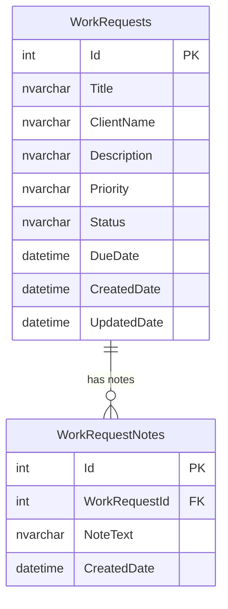

# Work Request Tracker DB Design

Version     : DB-v0.1
Date        : 2026-05-21
Author      : Senthilvel T
Mode        : DB_ONLY inside /swp-design
Scope       : Job code assessment / minimal persistence design

## Decision Summary

The database design stays intentionally small for the assessment. The submitted implementation uses in-memory persistence, while `README.md` carries the SQL schema expected by the assignment.

Chosen model:
- Database engine: SQL Server compatible schema
- ORM/data access: Dapper selected for SQL Server persistence; Entity Framework Core not used
- Schema: `dbo` for assessment simplicity, matching the existing README and SRS
- Tables: `WorkRequests`, `WorkRequestNotes`
- Stored procedures: not required for the assessment
- Auth, tenant isolation, audit users, and soft delete: out of scope
- Manual scripts: `Database/Scripts/001_CreateWorkRequestTracker.sql`, `Database/Scripts/002_SeedDemoData.sql`, `Database/Scripts/999_DropWorkRequestTracker.sql`

## Schema Assignment

| Area | Objects | Reason |
|---|---|---|
| dbo | WorkRequests, WorkRequestNotes | Single-feature assessment schema with no bounded-context split required. |

## Tables

### dbo.WorkRequests

| Column | Type | Constraints | Notes |
|---|---|---|---|
| Id | INT IDENTITY(1,1) | PRIMARY KEY | Surrogate key. |
| Title | NVARCHAR(200) | NOT NULL | Required request title. |
| ClientName | NVARCHAR(200) | NOT NULL | Required client name. |
| Description | NVARCHAR(MAX) | NOT NULL | Required request details. |
| Priority | NVARCHAR(20) | NOT NULL | Allowed values: Low, Medium, High. |
| Status | NVARCHAR(20) | NOT NULL | Allowed values: New, InProgress, Blocked, Completed. |
| DueDate | DATETIME2 | NOT NULL | Required due date. |
| CreatedDate | DATETIME2 | NOT NULL | Set on create. |
| UpdatedDate | DATETIME2 | NOT NULL | Updated on status or note changes. |

Indexes:
- `IX_WorkRequests_Status_DueDate` on `(Status, DueDate)`
- `IX_WorkRequests_ClientName_Title` on `(ClientName, Title)`

### dbo.WorkRequestNotes

| Column | Type | Constraints | Notes |
|---|---|---|---|
| Id | INT IDENTITY(1,1) | PRIMARY KEY | Surrogate key. |
| WorkRequestId | INT | NOT NULL, FK to `dbo.WorkRequests(Id)` | Parent work request. |
| NoteText | NVARCHAR(MAX) | NOT NULL | Required note body. |
| CreatedDate | DATETIME2 | NOT NULL | Set on note create. |

Relationship:
- `dbo.WorkRequests` 1-to-many `dbo.WorkRequestNotes`
- Delete behavior: no cascade required for the assessment; production version should prefer soft delete.

## ER Diagram

## Query Plan

| Use case | Query support |
|---|---|
| List requests with paging | `ORDER BY DueDate`, `OFFSET/FETCH` in a SQL-backed version. |
| Filter by status | `IX_WorkRequests_Status_DueDate`. |
| Search title/client | `IX_WorkRequests_ClientName_Title`; production version may add full-text search. |
| Get request detail | Primary key lookup on `WorkRequests`, then notes by `WorkRequestId`. |
| Add note | Insert `WorkRequestNotes`, then update parent `UpdatedDate`. |

## Migration Plan

For SQL Server with Dapper:
1. Create `WorkRequests`.
2. Create `WorkRequestNotes` with FK to `WorkRequests`.
3. Create `IX_WorkRequests_Status_DueDate`.
4. Create `IX_WorkRequests_ClientName_Title`.
5. Create `IX_WorkRequestNotes_WorkRequestId`.
6. Optional demo seed data for local review only.

Manual script run order:
1. `Database/Scripts/001_CreateWorkRequestTracker.sql`
2. `Database/Scripts/002_SeedDemoData.sql`

Rollback:
1. Run `Database/Scripts/999_DropWorkRequestTracker.sql`.

## Security and Compliance

| Area | Assessment decision | Production note |
|---|---|---|
| PII | `ClientName` may be personal/business identifying data. | Avoid logging request payloads; consider masking or access controls. |
| Auth | Out of scope. | Add authenticated users and authorization if productionized. |
| Tenant isolation | Out of scope. | Add `TenantId` only if the product becomes multi-tenant. |
| Soft delete | Out of scope. | Add `IsDeleted`, `DeletedDate`, and filtered indexes if deletion/audit is required. |
| Audit actor | Out of scope. | Add `CreatedBy` and `UpdatedBy` after auth exists. |

Security signal: CLEAR for assessment scope.

## DB Go / No-Go

| Dimension | Score | Evidence |
|---|---:|---|
| Schema coverage | 20/20 | SRS entities mapped to two tables. |
| Relationships | 20/20 | Notes linked to work requests with FK. |
| Query support | 20/20 | Status, due date, client, and title indexes documented. |
| Migration clarity | 20/20 | Create and rollback order documented. |
| Assessment fit | 20/20 | Avoids out-of-scope auth, tenancy, SP, and audit overhead. |

Total: 100/100  
Verdict: GO for assessment.

## Downstream Flags

| Impact area | Change | Required action |
|---|---|---|
| Backend persistence | Runtime repository uses Dapper against SQL Server. | Optional future task: add integration tests if reviewer asks for database-backed test coverage. |
| API contract | No API changes required. | Existing endpoints match DB entities. |
| README | SQL schema already present. | Keep root `README.md` only; do not add root planning docs. |

## Approval

DB design approved to proceed to Phase 3 planning.
