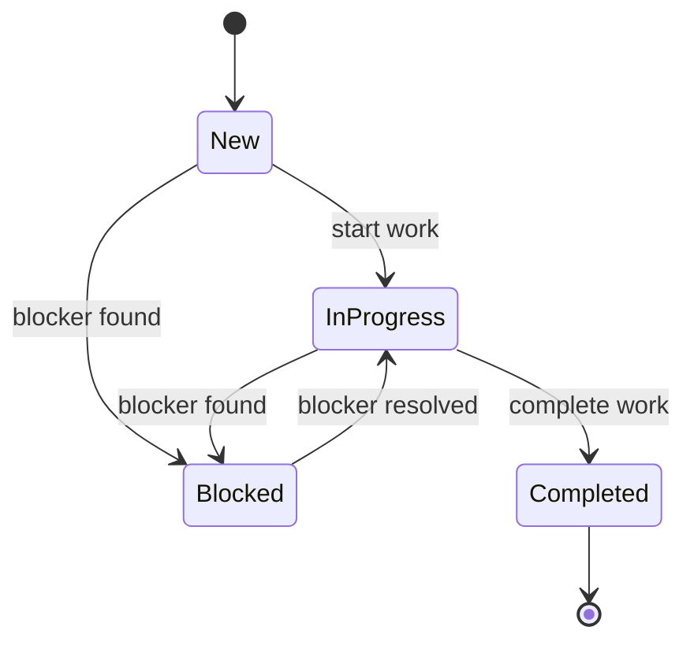

# Entities

SRS Version : SRS-v0.1
Generated   : 2026-05-21
Generated by: /swp-srs
Author      : Senthilvel T

## dbo

| Entity | Key Columns | Auditable | Status Lifecycle | Layer Mapping |
|---|---|---|---|---|
| dbo.WorkRequest | Id, Title, ClientName, Priority, Status, DueDate, CreatedDate, UpdatedDate | Yes | Yes | backend/FlexGCCLLC.WorkRequestTracker.Api/Features/WorkRequests/Models/WorkRequest.cs |
| dbo.WorkRequestNote | Id, WorkRequestId, NoteText, CreatedDate | Yes | No | backend/FlexGCCLLC.WorkRequestTracker.Api/Features/WorkRequests/Models/WorkRequestNote.cs |

## State Machine: WorkRequest

